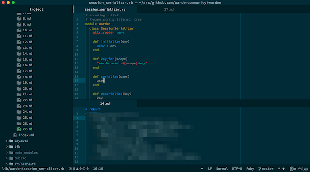

数ヶ月前から開発するときに作業メモをとりながら開発をするようにしている。スクショのようにエディタを上下に分割して上で作業しながら下でメモをとっている。

作業メモという習慣を数ヶ月続けてみていいことが多かった。

* デバッグするときは、どこにバグがあるか仮説を作業メモにとりながら進める。頭の中だけでこれを行うのはけっこう大変で、脳のメモリが食いつぶされるのを感じる。
* 作業が煮詰まったときに、これまでの作業を振り返るきっかけにもなる。
* 土日や休日を挟んでから作業に戻るとき、どこまで何をしていたのか作業を振り返るときに便利だったりする。
* 作業内容やそこから得られた知見を他人と共有する際に、作業メモをベースにしやすい。
