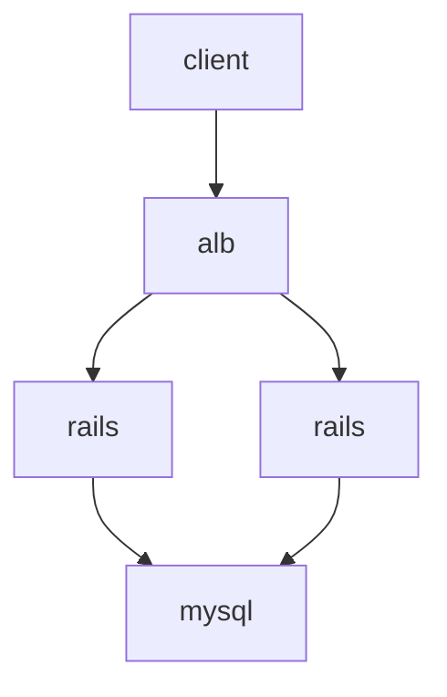

# 追記
デプロイしてから分かったけど、production buildのみ図の描画がうまくいったりいかなかったりする。リロードしてみるとたまに表示できる。よくわからないので、SSRでの実装にするかも。

---

markdownみたいなかんたんな記法でフローチャートなどの図を描ける[mermaid.js](https://mermaid-js.github.io/mermaid/#/)をこのブログでサポートした。

たとえばこんな感じ。



この図はこんなcode blockで書いている（エスケープだけしてある）。

```markdown
\```mermaid
graph TD
  client
  lb[alb]
  app1[rails]
  app2[rails]
  db[mysql]

  client --> lb --> app1 & app2 --> db
\```
```

# mermaid.jsをgatsbyで動かす
mermaid.jsはブラウザ上じゃないと動かすことができないため、gatsbyで動かすには

1. クライアントサイドで動かす
1. headless browserを利用してSSRする

の2通りしかない。

今回はより簡単にクライアントサイドで動かすようにした。既存のgatsby-remark-mermaidプラグインは後者を採用していてpuppeteerをつかっていた。ただ、試してみたところ自分の環境では動かなかったため、自作することにした。

Gatsbyで生成しているページはReactのコンポーネントでできているので、`componentDidMount`や`componentDidUpdate`のようなタイミングでmermaidを動かしている。

```js
import mermaid from "mermaid";

class PostTemplate extends Component {
  componentDidMount() {
    const element = document.getElementById("mermaid");

    mermaid.initialize({ startOnLoad: true });
    mermaid.mermaidAPI.render("container", "graph TD\n  a --> b", svg => {
      element.innerHTML = svg;
    })
  }
}
```

あとは、remarkプラグインを書いて、`mermaid`がついたcode blockを`<div class="mermaid"></div>`で囲うように変換するようにした。

```js
const visit = require("unist-util-visit");

module.exports = ({ markdownAST }, pluginOptions) => {
  visit(markdownAST, "code", node => {
    if (node.lang !== "mermaid") return;

    node.type = "html";
    node.value = `<div class="mermaid">\n${node.value}\n</div>`;
  });

  return markdownAST;
};
```
