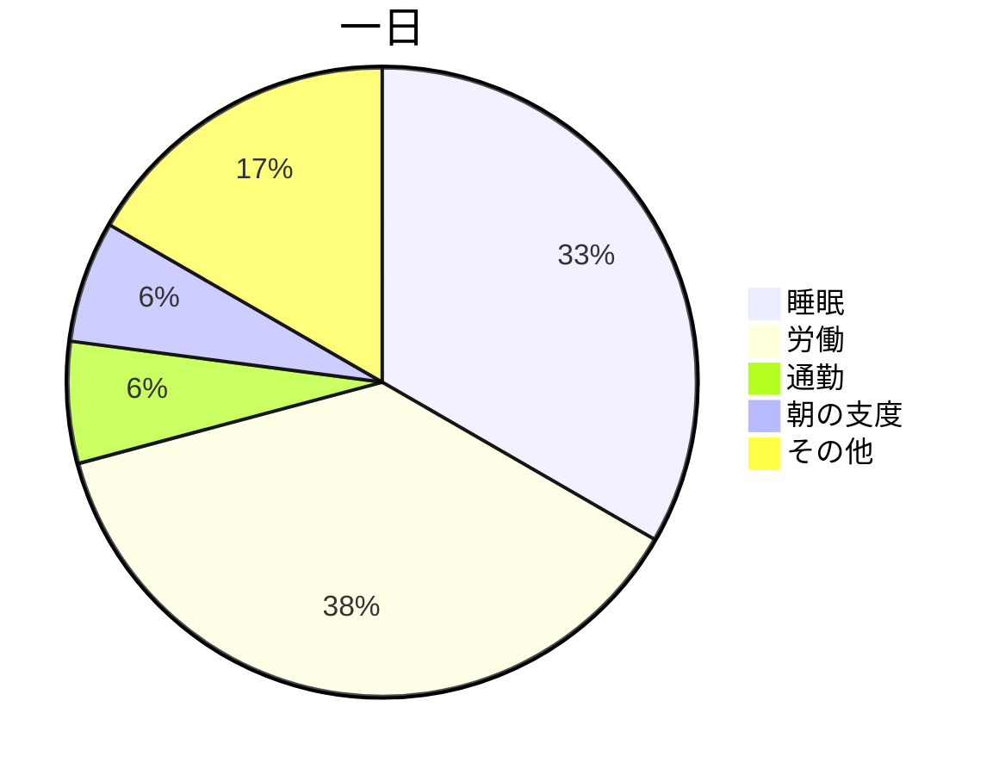

[前回](/404/)、このブログにmermaid.jsで描いたグラフを埋め込めるようにしたんだけど、リロードすると表示されたりされなかったり不安定な挙動だった。



そこで、クライアントサイドでmermaid.jsを実行するのではなく、gatsbyがページを生成するタイミングでpuppeteer上でmermaid.jsを実行し、レンダリングされたSVGをページに埋め込むようにした。これで、リロードするたびに表示されたりされなかったりすることはない。

# 実装
雰囲気だとだいたいこんな感じの実装をしている。

```js
const browser = await puppeteer.launch();
const page = await browser.newPage();
await page.goto(`file://${path.resolve(__dirname, "index.html")}`);
await page.addScriptTag({ path: require.resolve("mermaid/dist/mermaid.min.js") });

const result = await page.evaluate(() => {
  const text = "graph LR\n  a --> b";
  return new Promise((resolve, reject) => {
    try {
      mermaid.initialize({ startOnLoad: true });
      mermaid.mermaidAPI.render("diagram", text, svg => {
        resolve(svg)
      });
    } catch (e) {
      reject(e);
    }
  })
});

await browser.close();
```

* レンダリング用のHTMLを用意して、そこにmermaid.jsを埋め込む。
* 引数に渡した関数が`Promise`を返すとき`evaluate()`は解決を待ってくれるので、mermaid.jsのrenderが終わったタイミングで`resolve`を呼び出すようにしている。
* `evaluate()`は解決した結果を返すので、ここではレンダリング結果を受け取ることができている。
