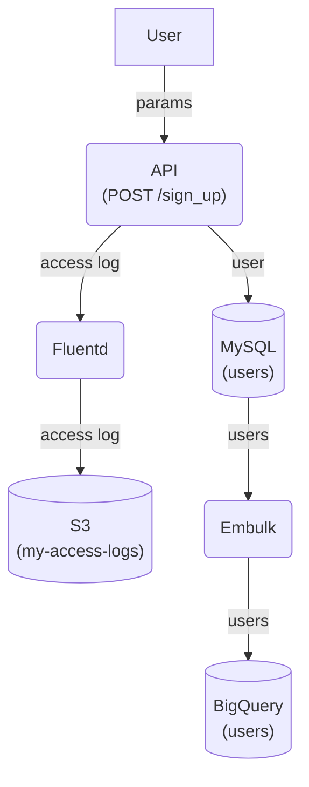

# 背景
仕事で複雑なシステムを理解するためにデータフロー図を書くことが多い。esaでmermaid.jsの記法で書いている。例えばこんな感じ。

```
graph TD
  e_user["User"]
  p_api_post_sign_up("API<br>(POST /sign_up)")
  d_mysql_users[("MySQL<br>(users)")]
  p_fluentd("Fluentd")
  d_s3_my-access-logs[("S3<br>(my-access-logs)")]
  p_embulk("Embulk")
  d_bigquery_users[("BigQuery<br>(users)")]

  e_user -- params --> p_api_post_sign_up
  p_api_post_sign_up -- user --> d_mysql_users
  p_api_post_sign_up -- access log --> p_fluentd
  p_fluentd -- access log --> d_s3_my-access-logs
  d_mysql_users -- users --> p_embulk
  p_embulk -- users --> d_bigquery_users
```

これはこうなる（このブログのレンダリングの実装の問題で潰れているけどしょうがない）。



実際の現場ではこれよりもはるかに複雑なデータフロー図を書いている。

# 問題
だんだんとテキストエディタで複雑なデータフロー図を書いていくのが難しいことに気づいてきた。1箇所直そうとすると、それに依存する部分も直さないといけないからだ。また、多数のnodeを規則的に書けるように命名規則を導入したくなる。

# 解決策
Next.js + TypeScriptの練習がてら、フォームから上のようなデータフロー図とmermaid.jsの記法のテキストを生成するアプリケーションを作った。

[naoty/dfd-editor](https://github.com/naoty/dfd-editor)


左側のテーブルでポチポチに入力していくと、右側にデータフロー図がリアルタイムに生成される。また、別タブでmermaid.jsのテキストも生成されるので、データフロー図の作成だけこれでやって結果をesaにコピペするみたいな使い方ができる。

最低限必要な機能を作っただけでまだどこかにデプロイもしていないけど、とりあえずこれで解決したい問題は解決できそうだ。
