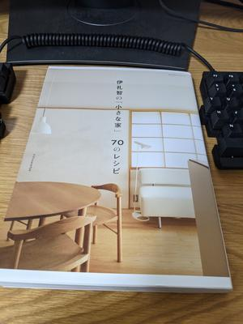

新しい家のインテリアや間取りを考えるために[伊礼智の「小さな家」70のレシピ](https://www.amazon.co.jp/dp/4767816920)という本を読んだ。居心地のいい空間を作り出すヒントが詰まった良い本だった。

心地いい居場所が連続した空間が心地いい家だとすると、心地いい居場所は何によって作り上げられるのか、この本にはこのような要素を取り上げている。

* 金物のような手で触れる部分の手触り感
* 長い時間の中で経年美化した素材感
* よい景色が望める窓
* 内部と外部がゆるやかに繋がったデッキ
* 小さくて籠もれる空間
* 浮いた家具や吊り戸によって繋がって見える床

反対に、こういった要素によって心地いい居場所は死んでしまうとも書いてあった。

* 天井につけられた明るすぎる照明
* 作りすぎた窓
* 白すぎる壁

明るい家にしようとするあまり、すべての空間が一様に照らされてしまい単調な居場所になってしまうのは確かに陥りやすいミスなのかもしれない。間取りやインテリアを検討するこのタイミングで読めたことはとても幸運だったと思う。
