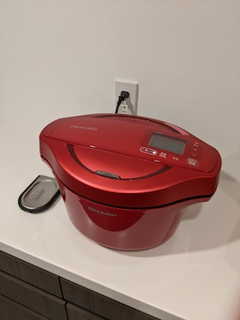
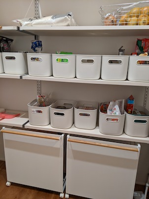

今年は家を建てて生活がガラッと変わったため、買うものが多かった。その中でも特によかったものをまとめてみた。家とか土地とかその他設備類はあんまり参考にならないと思うので除いた。

# [シャープ ヘルシオ ホットクック KN-HW24F](https://jp.sharp/hotcook/products/knhw24f/)

買ったというよりはキャンペーンでたまたまもらった。後述するぶんぶんチョッパーと合わせて料理の手間がかなり減ったため、noshを注文する頻度が減り、食費を節約できた。一番大きいサイズのものをもらったので、夫婦2人ではやや多いと感じることがある。スープを作ってもなかなか消費できない。メインや作りおきは大きめでいいけど、別の用途でもう1台買うかもしれない。

# [K&A ぶんぶんチョッパー強化版SUPER 5](https://k-and-a.jp/bbc-24.html)
ホットクックのレシピにはみじん切りがよく出てくる。そこで、ぶんぶんチョッパーを使ってみじん切りにしてホットクックに投入するようになった。従来のモデルでは食洗機に対応していなかったけど、ちょうどいいタイミングで食洗機に対応したモデルが登場したので買ってみた。おかげで料理だけでなく後片付けも時短につながった。

# [KEYUCA arrotsダストボックス](https://www.keyuca.com/shopping/user_data/dustbox.php)
フタがしまるとき静かなのがいい。シンプルなので目立たない。複数のゴミ袋をつけられるのも便利だった。

# [KINTO SCSトレイ](https://kinto.co.jp/products/27654)
今までランチョンマットを使っていたけど、配膳とマットを兼用できるトレイを買った。はじめは無印のトレイを使っていたけど、角がテーブルに当たってキズができたため、角が丸いトレイを買い直した。持ち手が浮いているため、持ちやすくて便利。

# [山崎実業 目隠し分別ダストワゴン](https://www.yamajitsu.co.jp/lab/item/%E7%9B%AE%E9%9A%A0%E3%81%97%E5%88%86%E5%88%A5%E3%83%80%E3%82%B9%E3%83%88%E3%83%AF%E3%82%B4%E3%83%B3-%E3%83%88%E3%82%B9%E3%82%AB-3%E5%88%86%E5%88%A5.html)

ビン、カン、ペットボトル、牛乳パック、もえないゴミを分別して捨てるために買った。ゴミ袋をきれいに隠してくれる。パントリーの棚にちょうどマッチしていて、雰囲気を損ねずにゴミ袋を設置できた。

# [山崎実業 ダンボールストッカー](https://www.yamajitsu.co.jp/lab/item/%E3%83%80%E3%83%B3%E3%83%9C%E3%83%BC%E3%83%AB%E3%82%B9%E3%83%88%E3%83%83%E3%82%AB%E3%83%BC%E3%82%BF%E3%83%AF%E3%83%BC.html)
引っ越しやその後の買い物で大量に段ボールが出たので、それらをまとめておくのに役に立った。日常的にもAmazonやnoshやウォーターサーバーの水など頻繁に段ボールが届くので助かっている。

# [+d ペーパーナイフ バーディ](https://koncent.jp/?pid=36821193)
インテリアとして出しておけるので、封筒が届いたらすぐにこれで開封できる。

# [TEIJIN あっちこっちふきん 厚手版](https://acchikocchi.jp/%e3%81%82%e3%81%a3%e3%81%a1%e3%81%93%e3%81%a3%e3%81%a1%e3%81%b5%e3%81%8d%e3%82%93-%e5%8e%9a%e6%89%8b%e7%89%88/)
食器拭き、台拭き、窓拭きなどいろんなところで使っている。異常に吸水するので家事の時短になっている。ピンクとかグリーンとか浮きやすい色はキッチンでは使わないようにしている。グレーの厚手版が出てほしい。

# [デコホーム ラバーマルチハンガー](https://www.nitori-net.jp/ec/product/5850422s/)
室内干しと収納を兼用できるし、襟元を広げずにかけられるので洗濯がとても楽になった。また、プラスチック製なので金属製のポールと擦れたときのイヤな音が出ないのもポイントが高い。こんな感じのズボン/スカートハンガーがあったらほしいんだけど、見当たらない。

# [ニチベイ アルペジオ](https://www.nichi-bei.co.jp/jsp/category/tb/arp/)
自分のワークスペースの窓掛けとしてニチベイのアルペジオというバーティカルブラインドを買った。ブラインドの角度をつけて部屋に入る日光を微調整できるだけでなく、カーテンのように横にスライドして窓を開けることもできる。ワークスペースの外がちょうどベランダになっているので、通常のブラインドよりも都合がよかった。また、部屋の一面がすべて窓となっているため、窓掛けにこだわることで部屋の雰囲気がかなり良くなった。
