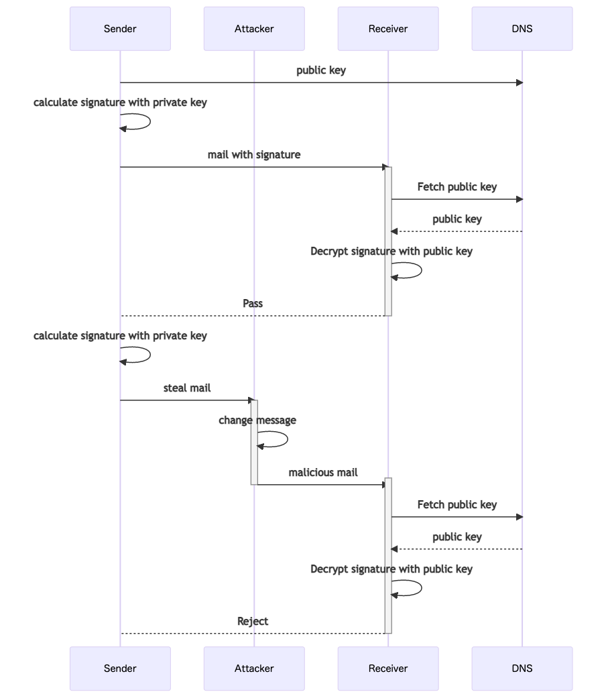
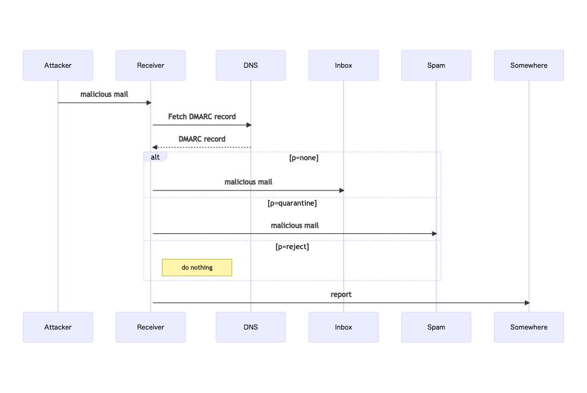

なりすましメールかどうかを見分けるために送信元メールアドレスを検証する仕組みについて調べたので自分なりに整理してみた。もっとわかりやすい記事はたくさんあるので、これは自分のためのメモにすぎない。

# エンベロープFromとヘッダFrom
検証する仕組みを説明する前に、なぜなりすましが可能なのか前提を踏まえておく必要がある。

送信元メールアドレスと呼ばれるものは、エンベロープFromとヘッダFromの2つ存在する。エンベロープFromはメールの送信に使われる情報で、ヘッダFromはメールクライアントで表示される情報だ。封筒に書かれた送信元と手紙に書かれた送信元が違う、といった説明がよく見られるけど分かりやすい例えだと思う。

エンベロープFromとヘッダFromは異なるアドレスを設定できる。2つが異なることによって、例えば、転送機能（転送者のアドレスがエンベロープFrom、転送者にメール送信したアドレスがヘッダFromになる）やメールの送信代行といったことが可能になる。一方で、悪意のある攻撃者が別人のアドレスをヘッダFromに設定することでなりすますことが可能になる。

また、ヘッダFromだけでなく、エンベロープFromも悪意のある攻撃者によってなりすまされる可能性がある。エンベロープFromはSMTPの`MAIL FROM`コマンドによって設定されるが、SMTPではそのメールアドレスの所有者本人が設定しているかどうかを検証できない。

# SPF
SPFはエンベロープFromにあるメールアドレスが送信者本人のものかどうかをDNSを利用して検証する。

* 受信者はエンベロープFromのドメイン（図だとnaoty.dev）のDNSサーバーにSPFレコードを問い合わせる。
* SPFレコードにはそのドメインで送信できるIPアドレスが記載されている。
* 受信者は送信者のIPアドレスがSPFレコードに含まれているか確認する。含まれていなければ、なりすましと見なす。

# DKIM
DKIMは公開鍵暗号を使ってメールの中身が改ざんされていないかを検証する。

* 送信者はあらかじめDNSに公開鍵を登録しておく。
* 送信者は秘密鍵を使ってメールのメッセージ等から電子署名を生成し、`DKIM-Signature`ヘッダに設定してメールを送信する。その際、公開鍵が登録されたDNSサーバーや公開鍵の識別子（セレクタ）を`DKIM-Signature`に設定する。
* 受信者は`DKIM-Signature`で指定されたDNSサーバーから公開鍵を取得し、電子署名をデコードしてハッシュ値を取り出す。もし、メールが改ざんされていれば受信したメールから計算したハッシュ値と一致しないはずなので、改ざんされたと見なす。

# DMARC
DMARCはSPFやDKIMで認証に失敗したメールをどう扱うかを送信者側で設定できる仕組みを提供する。

* 送信者はあらかじめDMARCレコードをDNSに登録しておく。
* 受信者はDMARCレコードを取得して、そこにある`p`タグで指定された方法で認証に失敗したメールを処理する。
* 受信者は認証に失敗したメールに関するレポートをDMARCレコードで設定されたメールアドレスに送る。レポートを集めることで、認証に失敗したメールがどういったものなのか（認証に失敗してはいけないメールを失敗させていないか等）を知ることができる。
