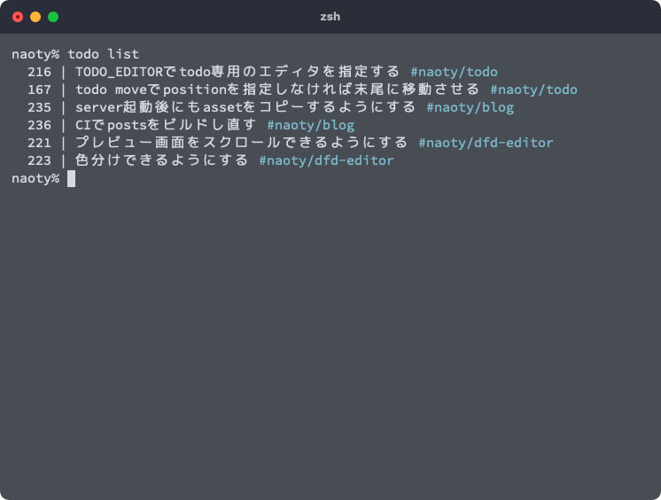

自分専用のTODO管理ツールである[naoty/todo](https://github.com/naoty/todo)にタグ機能を追加した。



`#naoty/todo`とついているのがタグで、以下のコマンドで複数つけることができる。

```
% todo add '芝刈り機を買う' --tag '家' --tag '出費'
 1 | 芝刈り機を買う #家 #出費
```

タグは各TODOファイルのfront matterに配列として保持している。

```
---
title: 芝刈り機を買う
state: undone
tags: ["家", "出費"]
---

# 2022-08-20
* 駅前のホームセンターでいくつか見てみたが、もう少しネットで調査することにした。
```

これまで、TODOをグルーピングする際にこんな感じで親子関係を利用していたのだが、

```
% todo list
  237 | review
        160 | https://github.com/naoty/todo/pull/1
        183 | https://github.com/naoty/todo/pull/2
        187 | https://github.com/naoty/todo/pull/3
```

親TODOは実際にはTODOではなく、ただのフォルダとしてしか使っていないことに気づき、本来の用途とは違うと思ったため、代替手段としてタグで管理できるようにした。

```
% todo list
  160 | https://github.com/naoty/todo/pull/1 #review
  183 | https://github.com/naoty/todo/pull/2 #review
  187 | https://github.com/naoty/todo/pull/3 #review
```

今のところ、タグによってTODOをフィルタリングするような機能はないので、これから作っていきたい。
