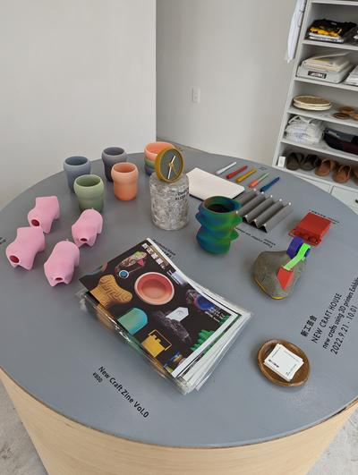
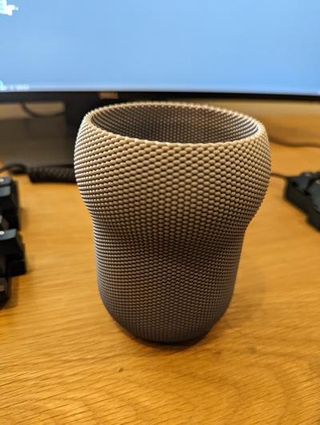

# 有給消化の過ごし方
転職まで3週間くらい有給消化でゆっくり過ごしている。

だいたいの時間、次の職場で必要になりそうな技術、具体的にはFlutter、dart、gRPCなどに入門してみたり、サンプルアプリケーションを作って感触を確かめている。Flutterの第1印象としては、それっぽいアプリが簡単に実装できてすごいと思った。あとは、React的な状態管理手法がモバイルアプリ開発にも導入されていて、こういった開発手法はすっかり定着しているなと思った。5年以上前にSwiftでiOSアプリを書いている頃はそういった手法が導入されつつある雰囲気があったくらいだったと思う。dartは、今のところコンストラクタが異様に難しく感じるが、それ以外はすんなり飲み込める言語という感じ。Goは表現力が足りないけど、Rustは難しそうみたいな感想を持つ層には支持されるんじゃないだろうか、と思った。

# 2022-09-21
今日はプログラミングをお休みして、以前から気になっていた[新工芸舎さん](https://www.shinkogeisha.com/)の展示が東京で行われると聞いて、池上までいってきた。ついでに、乗り換え駅の五反田でおにやんまのうどんを久々に食べてきた。

3Dプリンターで樹脂を編むように積み重ねて作られているとのことで、前々から気になっており、実物を見れてよかった。展示されているものの一部は購入可能だったため、HyotanStandというペンスタンドを1つ買ってみた。

鮮やかなグラデーションからソフトウェアみを感じつつも、網目状の質感から不思議と温かみも感じられる魅力的なプロダクトだった。

この頃は雨模様の天気だったけど、今日は天気もよく涼しく過ごしやすい陽気でとてもいい一日だった。
