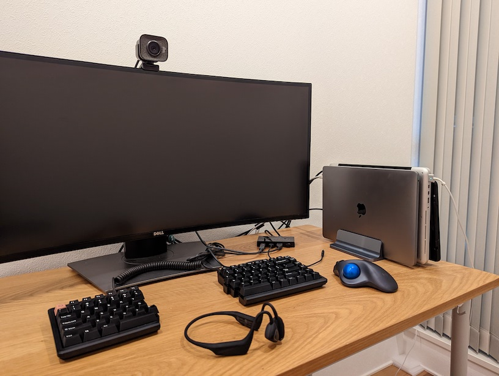
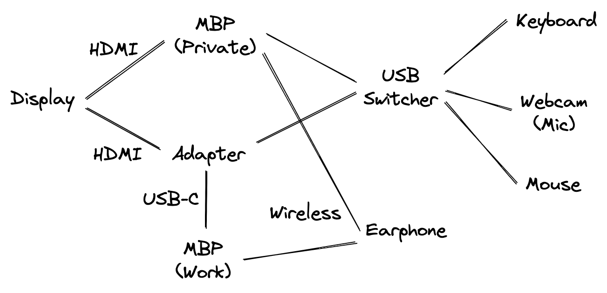

転職を機にPC周りの小物類を買い直した。

# ノートパソコンスタンド
https://www.amazon.co.jp/dp/B091GYPQD8

普段からPCは開かずにクラムシェルモードにしてワイドディスプレイのみで作業している。なので、私用と仕事用の2台のノートPCを立てて収納できるスタンドを買った。

幅をある程度調整できるため、さまざまな幅のPCに対応できて便利だった。あと、タブレットなどを立て掛けておけるくぼみもあるため、写真のように電子メモパッドを立て掛けている。

# USB切替器
https://www.amazon.co.jp/dp/B072R16Z6S

2台のPCでキーボード、マウス、Webカメラを共有するため、USB切替器を導入した。おかげで、仕事が終わって私用のPCを使うときにいちいちキーボードやマウスをつなぎ直していたけど、それがスイッチひとつで済ませられるようになった。

# 骨伝導イヤホン
https://www.amazon.co.jp/dp/B0BF48Y5CG

ちょうどいいタイミングで新たな骨伝導イヤホンが発売されたので、さっそく買ってみた。今まではゴツいヘッドセットを使っていたけど、耳がかゆくなってくるのが気になって耳を塞がないイヤホンにした。

よかった点としては、目論見どおり耳がかゆくならなくなって快適になった。あとは有線から無線になったことで、PCでもスマホでも使えるようになった。さらに、マルチペアリングに対応しているため、スマホとPC2台の間での切り替えが少なく済むのもよい（欲を言えば3台でマルチペアリングできてほしい）。

イマイチな点としては、いちおうマイクが内蔵されているもののほとんど声を拾ってくれないのでヘッドセットとしては使えなかった。あとは、頭にフィットしないので寝ながら使うことができなかったり、数時間つけてると耳が痛くなってくるのも惜しかった。

# Webカメラ
https://www.amazon.co.jp/dp/B086R71LGW

イヤホンのマイクが使えない代わりにWebカメラのマイクをあてにするため、いいやつを買ってみた。

だけど、これは正直、以前使っていた2, 3000円のWebカメラと比べてそこまで大きな良さを感じることはできなかった。良かった点はカメラの解像度が上がった程度で、マイクもそこまで優れているわけでもなく、映り方も自然になった気がするけど個人的には大差なく感じた。

# USB-Cアダプタ
https://www.apple.com/shop/product/MUF82AM/A/usb-c-digital-av-multiport-adapter

DELLのディスプレイの[問題](https://www.dell.com/support/kbdoc/ja-jp/000132068/power-chime-noise-from-macbook-when-charging-via-usb-c-on-u3419w-or-u3818dw-monitors-while-the-macbook-is-in-sleep-mode)により、MBPからUSB-Cで映像出力すると、別のPCで映像出力していても自動的に切り替わったり、電源を切っていても自動的に起動してしまうといった現象が起きていた。

そこで、ディスプレイをHDMIで接続するためにUSB-CとHDMIのアダプタを買った。このアダプタはUSB-Aのポートもあるので先述したUSB切替器と接続できるのが良い。アダプタと切替器を経由しても目立った接続不良は起きていない。

# PC周りの配線図

