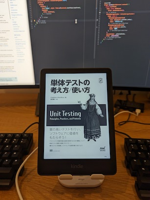

ずっと気になってたKindle Paperwhiteを買ってみた。

今まではAndroidのAdobe AcrobatアプリでPDFの技術書を読んでいたのだけど、集中が切れるとすぐにTwitterを開いてしまい、読書量が十分にとれていなかったのが課題だった。読書専用のデバイスによってこれを解決したいと思い、購入してみた。

PDFを読めるのかが懸念だったけど、MacとKindle PaperwhiteをUSBで接続すると、Finderにデバイスとして表示され、簡単にPC上のPDFを転送できたのでまったく問題なかった。

今のところ、読みたいマンガを読み尽くしておいたおかげか、技術書をかなり集中して読めており、読書量がかなり増えたと感じている。ディスプレイの特性上、スマホと比べるとレンダリングがモッサリとしているけど、読書に支障をきたすレベルにはなく、むしろ読書以外の余計な操作をする気力を削いでいるとも言えそう。
