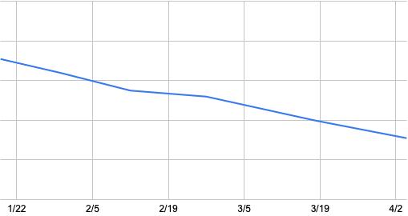

今年こそは運動しようと思ってパーソナルトレーニングを始めてから3ヶ月が経った。そのうち、始めの1ヶ月は食事指導も受けていて、おおむね食生活を変えずに過ごした。

最近は少し増えてしまったけど、MAXで4kg減らすことができた。3ヶ月で4kgなので、そんなに減ってはいないのかもしれないけど、ストレスなく続けた割にはちゃんと成果が出たと思っている。

# トレーニング
週2回のペースでジムに行き、45分間トレーニングしていた。内容としては、脚のトレーニングに加えて、胸のトレーニングと背中のトレーニングを交互にやっていた。この3つが人体で最も大きい筋肉だそうで、これらを鍛えることで基礎代謝が上がりやすくなるとのことだった。

ベンチプレスは始めは25kgを10回3セット上げていたけど、最後には40kgを上げるようになった。また、ブルガリアンスクワットも重りなしでフラフラしながらやっていたけど、9kg * 2のバーベルを持ってやれるようになった。こういった目に見える成長のおかげで楽しみながら続けることができた。

途中からは有酸素運動も取り入れるため、自宅からジムまで歩くようにして、週2回は1時間歩くようになった。おかげで、階段や坂道で息切れしにくくなった気がする。ウォーキングのお供にポッドキャストを聞くようになり、習慣化できてきた。

# 食生活
今までは炭水化物と脂質中心の食生活だったけど、タンパク質中心の生活に激変した。食事指導の結果、1日140gを目標にタンパク質を摂り、摂取カロリーを1600kcal程度に抑えるようにした。こうしたタンパク質中心の食生活でもストレスを抑えつつ続けられた食品をリストアップしたい。

- サラダチキン: 我が家にはホットクックがあるため、簡単に鶏むね肉からサラダチキンを錬成することができた。カロリーを抑えつつ、タンパク質を大量に摂取できるので最高。
- プロテイン: トレーニングを始めてから人生で初めてプロテインを飲むようになったけど、思っていたよりもおいしくて驚いた。バニラ味はあんまり好きじゃないけど、SAVASのリッチショコラ味はちょっとした甘いものの代わりになってしまうくらいにはおいしかった。腹持ちもよく、間食として摂取していた。
- プロテインバー: お菓子代わりに食べていた。1本満足バーがカロリーを抑えつつ、タンパク質が摂れるのでよく食べている。1つあたりの値段が少し高いのが気になるけど。
- 鶏肉入り味噌汁: 朝食にご飯を食べる場合のおかずとして、鶏むね肉や鶏もも肉を味噌汁に入れて食べていた。あまった野菜と鶏肉で雑に作れるので便利だし、朝食に温かい味噌汁を飲むのは食事指導でもオススメされていた。
- ベースブレッド: 朝食にパンを食べる場合はベースブレッドを食べていた。タンパク質がそこそこ摂れて、ちゃんとおいしいので、今まで食べてきた食パンから完全に置き換わった。
- ギリシャヨーグルト: だいたいタンパク質が10gくらいとれて、朝食にちょい足しするのにちょうどいいので、パン食では毎日食べていた。

# 今後
パーソナルトレーニングのおかげで運動習慣と食習慣が身についた。ただ、そこそこ高額なので、ここで打ち切って、一般的なジムにシフトしようとしている。トレーニングのやり方について細かく指導していただいたので、スムーズに移行できると思っている。

食生活も緩むことなく、引き続き改良を重ねて楽しみながら続けていきたい。
