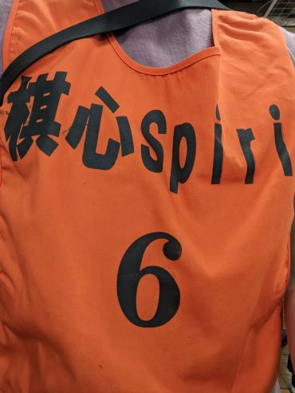

はじめて社団戦に参加してきた。社団戦というのは、1チーム7人の団体戦で、より勝ち数が多いチームが勝ち点を得る。現在は7つのクラスに分かれており、年間の勝数が多いチームが上のクラスに昇級できる仕組みになっている。国内最大級のアマチュアの将棋の大会らしい。会場には1,000人くらいはいたんじゃないかと思う。

先週参加した大会でそこそこ成績がよかったというのもあり、「棋心スピリット」というチームに助っ人として声をかけていただいた。7人を集めるだけでもかなり大変だと思う。僕が入ったチームは5部だったのだけど、話によるとそれでもアマチュア三段程度の棋力があるらしい。

# 戦績
結果としては、個人では3勝1敗、チームは4勝0敗で、かなりの好成績だった。今日以前の成績ではチームは5部のリーグでは2位だったので、もしかしたら今日の結果で1位になったかもしれない。このまま行けば4部への昇級が確定しそうなので、貢献できてよかった。

# 感想
これだけ多くの人々がひとつの場所で将棋を指している光景というのは他では見られない景色で、いい夏の思い出になった。それにしても、老若男女問わずみんな将棋が強くて感心してしまった。いい刺激をもらったので、自分もより一層の努力を重ねていきたい。
