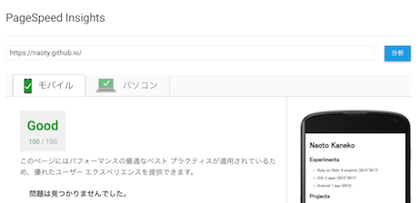

ブログをはてなブログからGitHub Pagesに移行した。

dev.toを見てからWebプログラマーのブログは高速に表示されるべきだと思うようになったので、GitHub Pagesに移行して、マークアップからすべてフルスクラッチすることにした。

移行にあたっていくつかStatic Site Generatorを試してみたが、どれもしっくりこなかったので、gulpのプラグインを組み合わせてHTMLやCSSを組み立てることにした。コードは[naoty/homepage](https://github.com/naoty/homepage)にある。

以下、やったこととか気をつけたこと。

* ページの各コンテンツをmarkdownで書くようにして、ejsで書いたレイアウトに展開するようにした。これは既存のgulpプラグインではできなかったため、独自にgulpプラグインを書いた。
* 各投稿からindexページを生成するようにした。ejsで書いたレイアウトに展開するようになっている。また、同時にファイルのmtimeを見てソートするようにしている。これも独自のgulpプラグインを書いて実現した。
* CSSはSASSで書いてCSSに変換して圧縮している。CSSはすべてHTMLの`<style>`タグ内につっこんでいる。こうすることで、CSSのレンダリングブロックを回避できるため、初回のレンダリングが少し速くなる。
* CSSを書く際に、モバイルファーストを念頭にまずスマホ表示を前提に書き始めた。そして、画面を広げながら、余白が気になる部分でメディアクエリを使って広い画面向けのスタイルを追加している。
* 最終的なHTMLは圧縮している。ここらへん、できる限りファイルサイズを抑えてパフォーマンスを最適化しようとしている。結果的に、PageSpeed Insightsでほぼ100点をとれるようになった。

* ファイル名をURLに使おうとすると、濁点や半濁点を含むファイル名が表示できなくなることがある。これは、macOSのファイル名はUTF-8-MACと呼ばれるエンコーディングが使われているためで、濁点や半濁点が通常のUTF-8と異なるために起きているらしい。
* ファイル名には自然数を使うようにし、タイトルはfront matterで指定するようにした。front matterでは、タイトルの他に`description`や`og:image`を設定できるようにした。
* Lighthouseを参考にmanifest.jsonを書くなどPWAの要件を満たすようにした。

* [naoty/homepage](https://github.com/naoty/homepage)のpublicディレクトリをgitサブモジュールにして[naoty/naoty.github.io](https://github.com/naoty/naoty.github.io)にpushするようにしている。
