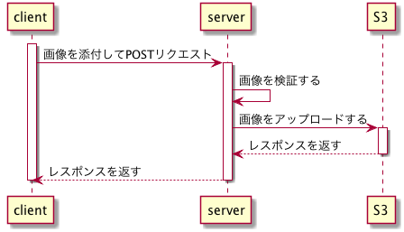
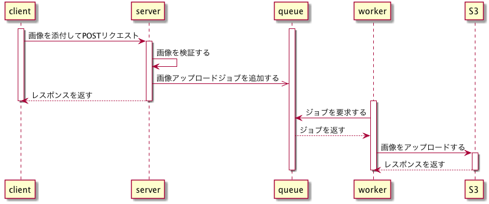
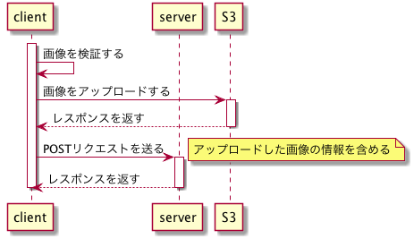

画像アップロードの実装は考えれば考えるほど難しい。サーバーサイドはもちろんのこと、インフラやフロントエンドにわたって幅広く知識が求められる。

これまでの経験を基に画像アップロードの実装パターンを3パターンにまとめてみた。

1. 同期アップロード
2. 非同期アップロード
3. ダイレクトアップロード

以下では、画像のアップロード先としてS3を想定する。また、画像のリサイズについては、画像リクエスト時にリサイズする方法などを考慮に加えると論点が発散しそうなので、いったん保留する。

# 同期アップロード

同期アップロードは、リクエストを受け取ったサーバーがS3に画像をアップロードするまでクライアントを待たせる。

そのため、非常に大きい画像や複数の画像をアップロードした場合、レスポンスタイムが非常に長くなることが予想できる。通常、Webサーバーはリクエストボディのサイズに上限を設定したり、リクエストのタイムアウト時間を設定しているため、そのようなリクエストはタイムアウトになってしまうだろう。

同期アップロードの実装は非同期アップロードに比べると簡単だし、非同期処理に伴う問題もない。だから、社内システムのようにユーザーを待たせても問題がない場合は同期アップロードを採用してもいいと思う。だけど、UI/UXが非常に悪いため、ユーザーが使う機能の実装としては採用できないと思う。

# 非同期アップロード

非同期アップロードは、リクエストを受け取ったサーバーとは別のワーカープロセスがバックグラウンドで画像をアップロードする。そのため、クライアントがレスポンスを受け取った時点ではアップロードが完了していない可能性がある。

同期アップロードと比べると、レスポンスタイムが改善され、複数の画像をアップロードすることも可能になる。しかし、非同期アップロードを実装するにあたり、考えなくてはいけないことがいくつかある。

* アップロードが失敗した場合にリトライさせる手段をどのように提供するか（UI/UX観点）。
* ジョブキューとワーカープロセス、そしてワーカープロセスを管理するプロセスをどのように開発時に用意するか（開発環境観点）。
* サーバーとワーカーの間でどのようにアップロードされた画像を受け渡すか（インフラ観点）。

それぞれの論点は、それだけで十分に1つの記事になりうるため、ここでは論点を挙げるだけに留めておきたい。

# ダイレクトアップロード

ダイレクトアップロードは、クライアントからサーバーを介さずに直接S3にアップロードし、完了後にファイルパスなどの情報のみサーバーに送る。

この方法でも、同期アップロードのようにクライアントを待たせるようなことはなく、複数の画像をアップロードできる。さらに、非同期アップロードのような複雑なアーキテクチャも必要がないため、スマートな方法のように思える。

この場合、画像をサーバーで処理できないため、画像のファイル形式の検証やウイルススキャンなどをクライアントで行う必要がある。アプリであればiOSとAndroid両方で実装が必要になるため、全体の実装工数は3つの実装パターンの中で最も大きいかもしれない。
