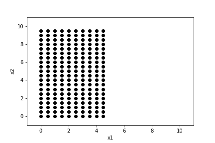
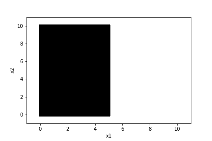
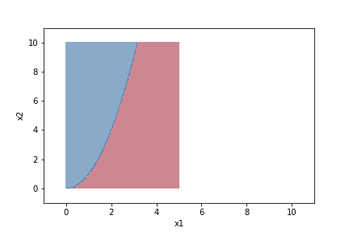

ロジスティック回帰など分類を行うアルゴリズムがちゃんとトレーニングデータを分類できているか確認するため、決定境界をプロットする方法を学んだ。そのメモをブログに残す。

## まとめ
* `np.meshgrid()`で格子点を取得する。しかも、`np.arange()`などを使ってできるだけ細かく格子点を取得する。
* 格子点を分類器に適用するため、トレーニングデータの形状に変換する。
* 格子点に対して分類を予測する。
* 格子点とその分類の予測を`plt.contourf()`を使って等高線としてプロットする。

## 格子点の取得

```python
x1 = np.arange(0, 5, 0.5)
x2 = np.arange(0, 10, 0.5)
X1, X2 = np.meshgrid(x1, x2)

plt.plot(X1, X2, 'ok')
plt.xlimit(-1, 11)
plt.ylimit(-1, 11)
plt.show()
```



上のように`np.meshgrid()`を使うと、2つの配列`x1`と`x2`からなる平面上にある格子点を取得できる。

この格子点の間隔を小さくすると、`x1`と`x2`からなる平面上の「すべての点」を擬似的に再現できる。

```python
x1 = np.arange(0, 5, 0.01)
x2 = np.arange(0, 10, 0.01)

# 以下同じ
```



## 格子点の変換
ある平面上の「すべての点」を分類器に適用すると、平面上に分類した結果をマッピングできるようになる。

そのために格子点をトレーニングデータの形状に変換する。つまり、$(x_1, x_2)$のようにする。

```python
# flatにする
X1_flatten = X1.ravel()
X2_flatten = X2.ravel()

# 結合して行列にする
X = np.array([X1_flatten, X2_flatten])

# 行方向がトレーニングデータ、列方向がフィーチャーになるように転置する
X = X.T
```

## 格子点を分類器に適用する

```python
Z = classifier.predict(X)
```

上で分類器に適用できるように変換できたので、あとは予測する。

## 等高線図でプロットする

```python
# プロットできるように形状を揃える
Z = Z.reshape(X1.shape)

plt.contourf(X1, X2, Z, cmap='RdBu', alpha=0.5)
plt.xlim(-1, 11)
plt.ylim(-1, 11)
plt.xlabel('x1')
plt.ylabel('x2')
plt.show()
```



_（上図は適当な関数を適用しただけです）_

`plt.contourf()`は等高線図を引きつつ、領域を塗りつぶしてくれるので決定境界をプロットするのに便利。
