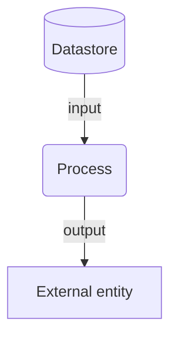
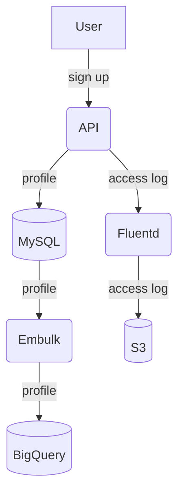

最近、仕事で大規模なデータ処理基盤にたずさわっている。自分の場合、複雑なものごとを理解するときにはまず全体像を理解するところからはじめている。データフロー図というものを描くと、データの流れを中心にデータ処理基盤を整理できて全体像の理解しやすくなった。

また、仕事ではesaを使ってドキュメントを残すため、Mermaid.jsでデータフロー図を描いてわかりやすいドキュメントを残せた。

# データフロー図
データフロー図は4つの要素から構成されている。

* **外部実体**: システムの外部にあるデータの発生源や出力先
* **プロセス**: データを入力し、データを出力する処理
* **データストア**: データを永続的に保管する場所
* **データフロー**: データの入力から出力への流れ

# Mermaid.js流データフロー図
Mermaid.jsにはデータフロー図を描くための専用の記法があるわけじゃない。だけど、フローチャート図の記法を使ってうまく描けそうということがわかった。

各要素を表す記法を下のように決める。

| 要素 | mermaid.js |
| --- | --- |
| 外部実体 | `external[External entity]` |
| プロセス | `process(Process)` |
| データストア | `datastore[(Datastore)]` |
| データフロー | `-- input -->`, `-- output -->` |

で、こんな感じで書く。

```
graph TD
  external[External entity]
  process(Process)
  datastore[(Datastore)]

  datastore -- input --> process -- output --> external
```

すると、こんな図が描ける。



# 例

```
graph TD
  user[User]
  api(API)
  mysql[(MySQL)]
  embulk(Embulk)
  bigquery[(BigQuery)]
  fluentd(Fluentd)
  s3[(S3)]

  user -- sign up --> api -- profile --> mysql -- profile --> embulk -- profile --> bigquery
  api -- access log --> fluentd -- access log --> s3
```



