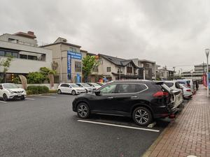
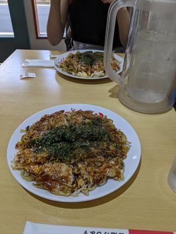
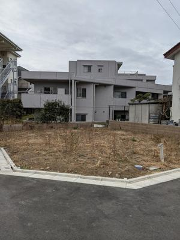
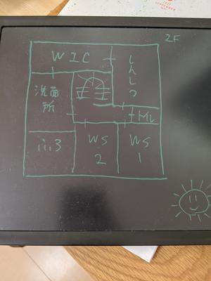
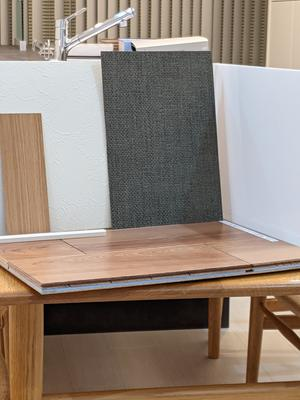

# 2020/8
* 軽いノリで住宅展示場に行く。後にこのときになんとなく入ったハウスメーカー（以下、HM）で家を建てることになる。

# 2020/9
* 家を建てることを検討しはじめる。
* ファイナンシャルプランナー（以下、FP）に住宅ローンとか資産運用とかの相談にのってもらう。情報量が多すぎるので住宅ローンだけに絞って相談すればよかった。

# 2020/10
* HMの営業さんから耐震性だとか断熱性だとか住宅の基本的な説明を受ける。
* セカンドオピニオンを求めてSUUMOカウンターにも相談する。

# 2020/11
* SUUMOカウンターに薦められて他のHMの話も聞きに行く。最初に話を聞いたHMと合わせると5社に話を聞いたことになる。
* 同時に、土地選びのために中央線、京王線、西武線などの沿線をぶらぶらする。

# 2020/12
* HMを3社に絞って実例の見学会や詳細な説明を受けた。
* この頃、ちょっとした出来事で相談していたFPに不信感を抱く。他のHMが紹介してくれた別のFPにも相談し現実的な予算を決めた。
* 年末に最初に話を聞いたHMで家を建てることに決めた。どのHMも耐震性能など十分に高かったため、最終的な決め手は営業さんとの相性だったと思う。

# 2021/1
* 年始から本格的に土地探しを始めた。良いと思っていた土地が先にとられているなど難航したものの、無事に好条件の土地が決まる。当初は候補に入っていないエリアだったものの、よくよく調べてみると住みやすい環境であることがわかった。

* 間取りについての打ち合わせが始まる。夫婦それぞれのワークスペースを確保しつつ、効率的な家事動線を意識して工夫した。また、厳しい建ぺい率によってできた空き地を活用するために外構計画を念頭におきキッチンや窓の位置を決めた。

# 2021/2
* インテリアの打ち合わせが始まった。決めることがとにかく多い。床材、壁紙、収納、照明、窓掛などをすべての部屋について考えることになった。

# 2021/3
* 設備の打ち合わせが始まった。キッチン、お風呂、トイレ、洗面台、冷暖房などのメーカー、製品、細かい仕様を決めていく。特にキッチンが難航した。HMが提携しているメーカーや製品ラインナップに制限があり、気に入った組み合わせが採用できないことがあるためだ。
* インターネット環境についてもこのタイミングで決める。各ワークスペースに有線LANケーブルを引き込み、将来的にCAT6のケーブルに入れ替えられるように配管を依頼した。

# 2021/4
* 土地の決済を行い、所有権が移転された。見たことのない金額が口座に振り込まれ、そして消える経験をした。
* 予算を予想以上にオーバーしたため、大幅にコストカットする。それでも当初の予算を超えることになった。また、補助金についても調査した。各省庁、都道府県、市区町村それぞれがバラバラに窓口があったため、HMの営業さんに協力してもらうことにした。
* 変更契約をおこなった。決定した仕様をもとに発注だったり工事の手続きが進むらしい。予算の都合で外構はHMではなく他の業者に依頼することにした。変更契約後に外構計画を引き続き進めることになった。

# 今後
* 5月に地鎮祭をおこない、いよいよ着工する。現場にも顔を出していきたい。
* 引き渡しまでの間に家具を買ったり、火災保険やインターネットなどの手続きを進める。
* 8月末くらいに引き渡し予定。

# 追記
* [その後](/455/)について書きました。
