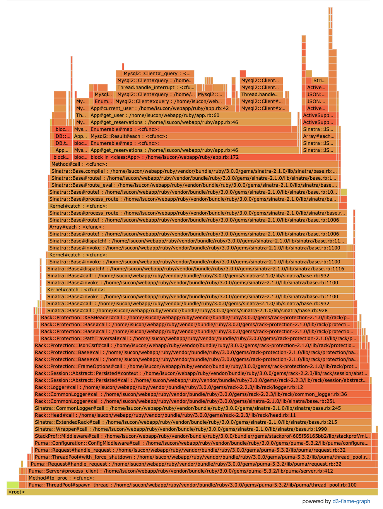

* その1
* [その2](/452/)

# 初期値
なにもしていない時点でベンチマークをとると、こうなった。

```bash
isucon@ubuntu-focal:~$ bin/benchmarker
10:32:35.193616 ERR: load: invalid: 存在しないはずのスケジュール ID です: 01FA4EA7ZJ85KFEPYZD8KBYPTY
10:33:45.648291 score: 882(883 - 1) : pass
10:33:45.648307 deduction: 1 / timeout: 0
```

# プロファイリング
まずはボトルネックを調査していく。[alp](https://github.com/tkuchiki/alp)を使ってアクセスログを分析する。

```bash
isucon@ubuntu-focal:~$ wget https://github.com/tkuchiki/alp/releases/download/v1.0.4/alp_linux_mips64.zip
isucon@ubuntu-focal:~$ unzip alp_linux_mips64.zip
isucon@ubuntu-focal:~$ sudo cat /var/log/nginx/access.log | alp ltsv -m '/api/schedules/.+' --reverse
+-------+-----+-----+-----+-----+-----+--------+-------------------+-------+-------+--------+-------+-------+-------+-------+--------+-----------+-------------+---------------+------------+
| COUNT | 1XX | 2XX | 3XX | 4XX | 5XX | METHOD |        URI        |  MIN  |  MAX  |  SUM   |  AVG  |  P1   |  P50  |  P99  | STDDEV | MIN(BODY) |  MAX(BODY)  |   SUM(BODY)   | AVG(BODY)  |
+-------+-----+-----+-----+-----+-----+--------+-------------------+-------+-------+--------+-------+-------+-------+-------+--------+-----------+-------------+---------------+------------+
|   530 |   0 | 530 |   0 |   0 |   0 | GET    | /                 | 0.012 | 0.364 |  3.576 | 0.007 | 0.000 | 0.008 | 0.000 |  0.024 |   195.000 |     195.000 |    103350.000 |    195.000 |
|   530 |   0 |  88 | 442 |   0 |   0 | GET    | /esm/index.js     | 0.000 | 0.000 |  0.000 | 0.000 | 0.000 | 0.000 | 0.000 |  0.000 |     0.000 | 1442198.000 | 126913424.000 | 239459.291 |
|   530 |   0 | 530 |   0 |   0 |   0 | GET    | /favicon.ico      | 0.020 | 0.376 |  3.884 | 0.007 | 0.000 | 0.004 | 0.004 |  0.024 |   195.000 |     195.000 |    103350.000 |    195.000 |
|   462 |   0 | 461 |   0 |   1 |   0 | GET    | /api/schedules/.+ | 0.008 | 1.300 | 62.155 | 0.135 | 0.016 | 0.872 | 0.416 |  0.143 |   151.000 |   24310.000 |   3890160.000 |   8420.260 |
|   450 |   0 | 448 |   0 |   2 |   0 | POST   | /api/reservations | 0.004 | 1.004 | 11.848 | 0.026 | 0.028 | 0.060 | 0.016 |  0.052 |    56.000 |     157.000 |     70459.000 |    156.576 |
|   443 |   0 | 443 |   0 |   0 |   0 | GET    | /api/schedules    | 0.008 | 0.304 | 12.788 | 0.029 | 0.000 | 0.012 | 0.032 |  0.034 |     2.000 |    1412.000 |    457613.000 |   1032.986 |
|    88 |   0 |  77 |   0 |  11 |   0 | POST   | /api/login        | 0.004 | 0.100 |  1.356 | 0.015 | 0.004 | 0.044 | 0.020 |  0.019 |    55.000 |     163.000 |     11529.000 |    131.011 |
|    87 |   0 |  87 |   0 |   0 |   0 | POST   | /api/signup       | 0.004 | 0.224 |  1.852 | 0.021 | 0.012 | 0.052 | 0.028 |  0.027 |   130.000 |     163.000 |     12353.000 |    141.989 |
|    10 |   0 |  10 |   0 |   0 |   0 | POST   | /api/schedules    | 0.008 | 0.036 |  0.208 | 0.021 | 0.036 | 0.024 | 0.008 |  0.010 |   120.000 |     130.000 |      1262.000 |    126.200 |
|     1 |   0 |   1 |   0 |   0 |   0 | POST   | /initialize       | 0.064 | 0.064 |  0.064 | 0.064 | 0.064 | 0.064 | 0.064 |  0.000 |    19.000 |      19.000 |        19.000 |     19.000 |
+-------+-----+-----+-----+-----+-----+--------+-------------------+-------+-------+--------+-------+-------+-------+-------+--------+-----------+-------------+---------------+------------+
```

レギュレーションによると

* `POST /api/schedules`: 10点
* `POST /api/login`: 1点
* `POST /api/reservations`: 1点

となっており、予約はそこそこ成功しているものの、スケジュールの作成が少ないために点数が伸びてないことがわかる。

次にクエリのボトルネックを調べるために、スロークエリログを有効にする。

```diff
+slow_query_log = 1
+slow_query_log_file = /var/log/mysql/mysql-slow.log
+long_query_time = 0.2
+log-queries-not-using-indexes
```

`pt-query-digest`を使うためpercona toolkitをインストールする。

```bash
isucon@ubuntu-focal:~$ sudo apt-get update
isucon@ubuntu-focal:~$ sudo apt-get install -y percona-toolkit
isucon@ubuntu-focal:~$ sudo pt-query-digest /var/log/mysql/mysql-slow.log

# 990ms user time, 30ms system time, 30.30M rss, 37.25M vsz
# Current date: Mon Jul  5 01:28:59 2021
# Hostname: ubuntu-focal
# Files: /var/log/mysql/mysql-slow.log
# Overall: 6.92k total, 3 unique, 85.43 QPS, 0.06x concurrency ___________
# Time range: 2021-07-04T16:27:20 to 2021-07-04T16:28:41
# Attribute          total     min     max     avg     95%  stddev  median
# ============     ======= ======= ======= ======= ======= ======= =======
# Exec time             5s    97us    26ms   733us     3ms     1ms   348us
# Lock time          503ms    29us    10ms    72us   138us   189us    44us
# Rows sent        244.43k       0      96   36.17   84.10   27.55   33.28
# Rows examine       2.71M       0     712  410.65  685.39  210.55  420.77
# Query size       572.33k      79     132   84.69  130.47   16.49   76.28

# Profile
# Rank Query ID                       Response time Calls R/Call V/M   Ite
# ==== ============================== ============= ===== ====== ===== ===
#    1 0x8AF515F23C6557EC1A32EFCBB...  4.8160 94.9%  6073 0.0008  0.00 SELECT reservations
#    2 0x91FE50B3151F73CAA931F4943...  0.2187  4.3%   712 0.0003  0.00 SELECT reservations
# MISC 0xMISC                          0.0425  0.8%   135 0.0003   0.0 <1 ITEMS>

# Query 1: 74.98 QPS, 0.06x concurrency, ID 0x8AF515F23C6557EC1A32EFCBB5E06C9B at byte 1972228
# This item is included in the report because it matches --limit.
# Scores: V/M = 0.00
# Time range: 2021-07-04T16:27:20 to 2021-07-04T16:28:41
# Attribute    pct   total     min     max     avg     95%  stddev  median
# ============ === ======= ======= ======= ======= ======= ======= =======
# Count         87    6073
# Exec time     94      5s    97us    26ms   793us     3ms     2ms   366us
# Lock time     89   449ms    29us    10ms    73us   144us   200us    44us
# Rows sent     99 244.32k       0      96   41.20   88.31   25.88   34.95
# Rows examine  90   2.46M       0     712  424.74  685.39  206.80  441.81
# Query size    81 468.52k      79      79      79      79       0      79
# String:
# Databases    isucon2021_prior
# Hosts        localhost
# Users        isucon
# Query_time distribution
#   1us
#  10us  #
# 100us  ################################################################
#   1ms  ########
#  10ms  #
# 100ms
#    1s
#  10s+
# Tables
#    SHOW TABLE STATUS FROM `isucon2021_prior` LIKE 'reservations'\G
#    SHOW CREATE TABLE `isucon2021_prior`.`reservations`\G
# EXPLAIN /*!50100 PARTITIONS*/
SELECT * FROM `reservations` WHERE `schedule_id` = '01F9S5H0MKDF0HG05FECEK3BTM'\G

# Query 2: 15.48 QPS, 0.00x concurrency, ID 0x91FE50B3151F73CAA931F494357A001F at byte 1208837
# This item is included in the report because it matches --limit.
# Scores: V/M = 0.00
# Time range: 2021-07-04T16:27:20 to 2021-07-04T16:28:06
# Attribute    pct   total     min     max     avg     95%  stddev  median
# ============ === ======= ======= ======= ======= ======= ======= =======
# Count         10     712
# Exec time      4   219ms   114us     5ms   307us   568us   244us   260us
# Lock time      7    37ms    35us   588us    52us    89us    43us    40us
# Rows sent      0       0       0       0       0       0       0       0
# Rows examine   8 247.13k       0     711  355.42  652.75  200.75  346.17
# Query size    16  91.78k     132     132     132     132       0     132
# String:
# Databases    isucon2021_prior
# Hosts        localhost
# Users        isucon
# Query_time distribution
#   1us
#  10us
# 100us  ################################################################
#   1ms  #
#  10ms
# 100ms
#    1s
#  10s+
# Tables
#    SHOW TABLE STATUS FROM `isucon2021_prior` LIKE 'reservations'\G
#    SHOW CREATE TABLE `isucon2021_prior`.`reservations`\G
# EXPLAIN /*!50100 PARTITIONS*/
SELECT 1 FROM `reservations` WHERE `schedule_id` = '01F9S5HW06RF9V13Z3PGT3B0YW' AND `user_id` = '01F9S5J076VP0H37MF2SZP05E1' LIMIT 1\G
```

スケジュールに関連する予約を取得する箇所がスロークエリになっていることがわかる。

次に[osyoyu/stackprof](https://github.com/osyoyu/stackprof)を使ってアプリケーションコードのプロファイリングをおこなう。`config.ru`でRackミドルウェアを追加する。

```diff
+gem 'stackprof', github: 'osyoyu/stackprof'
```

元の[tmm1/stackprof](https://github.com/tmm1/stackprof)と比べると https://github.com/tmm1/stackprof/issues/80 にあるような問題が修正されているものっぽい。

```diff
+require 'stackprof'
+use StackProf::Middleware,
+  enabled: ENV['ENABLE_PROFILE'].to_i.nonzero?,
+  mode: :cpu,
+  raw: ENV['ENABLE_RAW_PROFILE'].to_i.nonzero?,
+  interval: 1000,
+  save_every: 5

 run App.new
```

d3-flame-graphを使うために`raw: true`を追加してある。systemdは`~/env`をRailsサーバーの環境変数として設定するため、これを変更すればオン/オフを切り替えられる。

Railsサーバーを再起動させてベンチマーカーを実行する。

```bash
isucon@ubuntu-focal:~$ sudo systemctl restart web-ruby
isucon@ubuntu-focal:~$ bin/benchmarker
isucon@ubuntu-focal:~$ cd webapp/ruby
isucon@ubuntu-focal:~webapp/ruby$ bundle exec stackprof --d3-flamegraph tmp/stackprof-*.dump > tmp/flamegraph.html
```

こんな感じのflamegraphが生成されるため、ボトルネックがわかりやすくなった。`App#get_reservations`が占める割合が大きそうだ。



# benchmarker --progress
ベンチマーカーには`--progress`というオプションがあるようなので、これも試してみる。

```bash
isucon@ubuntu-focal:~$ bin/benchmarker --progress
02:51:43.810051 score: 0(0 - 0) : fail: score
02:51:43.810096 deduction: 0 / timeout: 0
02:51:44.161112 ERR: load: invalid: 存在しないはずのスケジュール ID です: 01F9SABH0GZRNF4QYJ7H07HK40
02:51:46.811650 score: 144(145 - 1) : pass
02:51:46.811808 deduction: 1 / timeout: 0
02:51:49.814398 score: 223(224 - 1) : pass
02:51:49.814416 deduction: 1 / timeout: 0
02:51:52.815522 score: 284(285 - 1) : pass
02:51:52.815538 deduction: 1 / timeout: 0
# snip
02:52:31.889060 score: 718(719 - 1) : pass
02:52:31.889083 deduction: 1 / timeout: 8
02:52:34.892716 score: 722(724 - 2) : pass
02:52:34.893451 deduction: 1 / timeout: 10
02:52:37.893911 score: 726(728 - 2) : pass
02:52:37.894326 deduction: 1 / timeout: 10
02:52:40.895119 score: 726(728 - 2) : pass
02:52:40.901700 deduction: 1 / timeout: 10
02:52:43.900161 score: 726(728 - 2) : pass
02:52:43.900926 deduction: 1 / timeout: 10
02:52:46.900517 score: 726(728 - 2) : pass
02:52:46.900537 deduction: 1 / timeout: 11
02:52:49.904001 score: 726(728 - 2) : pass
02:52:49.904036 deduction: 1 / timeout: 11
02:52:52.904344 score: 726(728 - 2) : pass
02:52:52.904365 deduction: 1 / timeout: 11
02:53:04.475732 score: 726(728 - 2) : pass
02:53:04.476582 deduction: 1 / timeout: 11
```

途中からスコアが伸びなくなっている。ベンチマーカーの仕様によるものに見えるので、ここもレギュレーションを見ながら対応したい。

# 下準備
普段Railsで開発していると陥りがちだけど、修正したコードは実行中のsinatraアプリケーションに反映されないので、ベンチマーカーを実行する前には一度再起動する必要がある。それを毎回やるのは面倒なので、スクリプトを用意しておく。また、stackprofのダンプファイルもクリーンアップしたいので、それもスクリプトで行う。

```bash
#!/bin/bash -e

sudo systemctl restart web-ruby
sleep 30
rm webapp/ruby/tmp/stackprof-*
bin/benchmarker
```

# get_reservations
flamegraphを見ると、`#get_reservations`に時間がかかっているため、修正していく。

```ruby
get '/api/schedules/:id' do
  id = params[:id]
  schedule = db.xquery('SELECT * FROM `schedules` WHERE id = ? LIMIT 1', id).first
  halt(404, {}) unless schedule

  get_reservations(schedule)

  json(schedule)
end

def get_reservations(schedule)
  reservations = db.xquery('SELECT * FROM `reservations` WHERE `schedule_id` = ?', schedule[:id]).map do |reservation|
    reservation[:user] = get_user(reservation[:user_id])
    reservation
  end
  schedule[:reservations] = reservations
  schedule[:reserved] = reservations.size
end

def get_user(id)
  user = db.xquery('SELECT * FROM `users` WHERE `id` = ? LIMIT 1', id).first
  user[:email] = '' if !current_user || !current_user[:staff]
  user
end
```

スケジュールに関連する予約を取得し、各予約に対して関連するユーザーを取得しているため、N+1クエリとなっている。1回のクエリでこれらを取得するように直す。

```diff
 def get_reservations(schedule)
-  reservations = db.xquery('SELECT * FROM `reservations` WHERE `schedule_id` = ?', schedule[:id]).map do |reservation|
-    reservation[:user] = get_user(reservation[:user_id])
-    reservation
-  end
-  schedule[:reservations] = reservations
-  schedule[:reserved] = reservations.size
+  reservations = db.xquery(<<~SQL
+    SELECT
+      r.`id` AS `r_id`,
+      r.`schedule_id` AS `r_schedule_id`,
+      r.`user_id` AS `r_user_id`,
+      r.`created_at` AS `r_created_at`,
+      u.`id` AS `u_id`,
+      u.`email` AS `u_email`,
+      u.`nickname` AS `u_nickname`,
+      u.`staff` AS `u_staff`,
+      u.`created_at` AS `u_created_at`
+    FROM
+      `reservations` AS r
+    JOIN
+      `users` AS u ON r.`user_id` = u.`id`
+    WHERE
+      r.`schedule_id` = ?
+  SQL)
+
+  schedule[:reservations] = reservations.map do |reservation|
+    {
+      id: reservation[:r_id],
+      schedule_id: reservation[:r_schedule_id],
+      user_id: reservation[:r_user_id],
+      created_at: reservation[:r_created_at],
+      user: {
+        id: reservation[:u_id],
+        email: (!current_user || !current_user[:staff]) ? '' : reservation[:u_email],
+        nickname: reservation[:u_nickname],
+        staff: reservation[:u_staff],
+        created_at: reservation[:u_created_at],
+      }
+    }
+  end
+  schedule[:reserved] = reservations.size
 end
```

ベンチマークをとる。

```bash
isucon@ubuntu-focal:~$ bin/benchmarker
06:15:41.612683 score: 910(910 - 0) : pass
06:15:41.612698 deduction: 0 / timeout: 0
```

少し改善されたように見える。次にflamegraphでボトルネックとして出ていた`#current_user`も見る。

```ruby
def current_user
  db.xquery('SELECT * FROM `users` WHERE `id` = ? LIMIT 1', session[:user_id]).first
end
```

メモ化していないため、`reservations.map`のブロック内で毎回ユーザーを取得してしまっている。

```diff
 def current_user
-  db.xquery('SELECT * FROM `users` WHERE `id` = ? LIMIT 1', session[:user_id]).first
+  @current_user ||= db.xquery('SELECT * FROM `users` WHERE `id` = ? LIMIT 1', session[:user_id]).first
 end
```

```bash
isucon@ubuntu-focal:~$ bin/benchmarker
06:20:51.566789 score: 1512(1512 - 0) : pass
06:20:51.566804 deduction: 0 / timeout: 0
```

一気にスコアが上がった。flamegraphを見ると、`#current_user`の中で最も時間がかかっているのはクエリの実行だけど、PKを指定したクエリなのでこれ以上は最適化できない。

そこで、上で修正したクエリを最適化する。`EXPLAIN`で実行計画を確認する。

```
mysql> explain select * from reservations join users on reservations.user_id = users.id where reservations.schedule_id = '01F9VB8MP2Y5S0K4CZQY8K5VRK';
+----+-------------+--------------+------------+--------+---------------+---------+---------+---------------------------------------+------+----------+-------------+
| id | select_type | table        | partitions | type   | possible_keys | key     | key_len | ref                                   | rows | filtered | Extra       |
+----+-------------+--------------+------------+--------+---------------+---------+---------+---------------------------------------+------+----------+-------------+
|  1 | SIMPLE      | reservations | NULL       | ALL    | NULL          | NULL    | NULL    | NULL                                  |  769 |    10.00 | Using where |
|  1 | SIMPLE      | users        | NULL       | eq_ref | PRIMARY       | PRIMARY | 1022    | isucon2021_prior.reservations.user_id |    1 |   100.00 | NULL        |
+----+-------------+--------------+------------+--------+---------------+---------+---------+---------------------------------------+------+----------+-------------+
2 rows in set, 1 warning (0.00 sec)
```

`type`が`ALL`となっており、フルテーブルスキャンになっている。`schedule_id`に対してインデックスを追加する。

```diff
 CREATE TABLE `reservations` (
   `id`          VARCHAR(255) PRIMARY KEY NOT NULL,
   `schedule_id` VARCHAR(255) NOT NULL,
   `user_id`     VARCHAR(255) NOT NULL,
-   `created_at`  DATETIME(6) NOT NULL
+  `created_at`  DATETIME(6) NOT NULL,
+  KEY (`schedule_id`)
 ) ENGINE=InnoDB DEFAULT CHARACTER SET=utf8mb4;
```

DBを作り直してベンチマークをとる。

```bash
isucon@ubuntu-focal:~$ webapp/tools/initdb
isucon@ubuntu-focal:~$ bin/benchmarker
06:25:40.386718 score: 1328(1328 - 0) : pass
06:25:40.386733 deduction: 0 / timeout: 0
```

スコアが下がってしまったが、実行計画は改善されている。

```
mysql> explain select * from reservations join users on reservations.user_id = users.id where reservations.schedule_id = '01F9VC5Q34QARA1A77H2WQWHM6';
+----+-------------+--------------+------------+--------+---------------+-------------+---------+---------------------------------------+------+----------+-------+
| id | select_type | table        | partitions | type   | possible_keys | key         | key_len | ref                                   | rows | filtered | Extra |
+----+-------------+--------------+------------+--------+---------------+-------------+---------+---------------------------------------+------+----------+-------+
|  1 | SIMPLE      | reservations | NULL       | ref    | schedule_id   | schedule_id | 1022    | const                                 |    8 |   100.00 | NULL  |
|  1 | SIMPLE      | users        | NULL       | eq_ref | PRIMARY       | PRIMARY     | 1022    | isucon2021_prior.reservations.user_id |    1 |   100.00 | NULL  |
+----+-------------+--------------+------------+--------+---------------+-------------+---------+---------------------------------------+------+----------+-------+
2 rows in set, 1 warning (0.00 sec)
```

もしかすると、インデックスによってINSERTの性能が落ちているかもしれないので、インデックスの追加は保留する。

# get_reservations_count
flamegraphを見ると、依然として`#get_reservations`が占める割合が高いままだけど、それはリクエスト数が多いからなので、他をあたることにする。次に多いのは`#get_reservations_count`なので実装を見ていく。

```ruby
get '/api/schedules' do
  schedules = db.xquery('SELECT * FROM `schedules` ORDER BY `id` DESC');
  schedules.each do |schedule|
    get_reservations_count(schedule)
  end

  json(schedules.to_a)
end

def get_reservations_count(schedule)
  reservations = db.xquery('SELECT * FROM `reservations` WHERE `schedule_id` = ?', schedule[:id])
  schedule[:reserved] = reservations.size
end
```

必要なのは予約数のみなので、すべてのカラムを取得せずに件数だけ取得する。

```diff
 def get_reservations_count(schedule)
-  reservations = db.xquery('SELECT * FROM `reservations` WHERE `schedule_id` = ?', schedule[:id])
+  reservations = db.xquery('SELECT COUNT(*) AS count FROM `reservations` WHERE `schedule_id` = ?', schedule[:id])
-  schedule[:reserved] = reservations.size
+  schedule[:reserved] = reservations.first[:count]
 end
```

```bash
18:03:08.151453 score: 1806(1806 - 0) : pass
18:03:08.151469 deduction: 0 / timeout: 1
```

スコアが上がった。

# POST /api/reservations
再度flamegraphを生成すると、`post '/api/reservations'`全体が占める割合が増えたため、実装を見ていく。

```ruby
post '/api/reservations' do
  required_login!

  transaction do |tx|
    id = generate_id('reservations', tx)
    schedule_id = params[:schedule_id].to_s
    user_id = current_user[:id]

    halt(403, JSON.generate(error: 'schedule not found')) if tx.xquery('SELECT 1 FROM `schedules` WHERE `id` = ? LIMIT 1 FOR UPDATE', schedule_id).first.nil?
    halt(403, JSON.generate(error: 'user not found')) unless tx.xquery('SELECT 1 FROM `users` WHERE `id` = ? LIMIT 1', user_id).first
    halt(403, JSON.generate(error: 'already taken')) if tx.xquery('SELECT 1 FROM `reservations` WHERE `schedule_id` = ? AND `user_id` = ? LIMIT 1', schedule_id, user_id).first

    # snip
  end
end
```

`user not found`エラーは`#required_login!`ですでにチェックしていることを二重にチェックしているため不要なはず。

```diff
 post '/api/reservations' do
   required_login!

   transaction do |tx|
     id = generate_id('reservations', tx)
     schedule_id = params[:schedule_id].to_s
     user_id = current_user[:id]

     halt(403, JSON.generate(error: 'schedule not found')) if tx.xquery('SELECT 1 FROM `schedules` WHERE `id` = ? LIMIT 1 FOR UPDATE', schedule_id).first.nil?
-    halt(403, JSON.generate(error: 'user not found')) unless tx.xquery('SELECT 1 FROM `users` WHERE `id` = ? LIMIT 1', user_id).first
     halt(403, JSON.generate(error: 'already taken')) if tx.xquery('SELECT 1 FROM `reservations` WHERE `schedule_id` = ? AND `user_id` = ? LIMIT 1', schedule_id, user_id).first

     # snip
   end
 end
```

```bash
18:22:16.026245 score: 1556(1556 - 0) : pass
18:22:16.026260 deduction: 0 / timeout: 1
```

スコアは減っているけど、おそらく誤差の範囲のはずなので続きを見る。

```ruby
post '/api/reservations' do
  required_login!

  transaction do |tx|
    # snip

    capacity = tx.xquery('SELECT `capacity` FROM `schedules` WHERE `id` = ? LIMIT 1', schedule_id).first[:capacity]
    reserved = 0
    tx.xquery('SELECT * FROM `reservations` WHERE `schedule_id` = ?', schedule_id).each do
      reserved += 1
    end

    # snip
  end
end
```

`reserved`をインクリメントしているので、`COUNT(*)`を取得するように直す。


```diff
 post '/api/reservations' do
   required_login!
 
   transaction do |tx|
     # snip
 
     capacity = tx.xquery('SELECT `capacity` FROM `schedules` WHERE `id` = ? LIMIT 1', schedule_id).first[:capacity]
-    reserved = 0
-    tx.xquery('SELECT * FROM `reservations` WHERE `schedule_id` = ?', schedule_id).each do
-      reserved += 1
-    end
+    reserved = tx.xquery('SELECT COUNT(*) AS count FROM `reservations` WHERE `schedule_id` = ?', schedule_id).first[:count]
 
     # snip
   end
 end
```

```bash
18:33:05.264692 score: 1786(1786 - 0) : pass
18:33:05.264705 deduction: 0 / timeout: 0
```

もう少しよく見てみると、予約を更新していないのに排他ロックを取得しているため、これをやめる。

```diff
 post '/api/reservations' do
   required_login!

   transaction do |tx|
     id = generate_id('reservations', tx)
     schedule_id = params[:schedule_id].to_s
     user_id = current_user[:id]

-    halt(403, JSON.generate(error: 'schedule not found')) if tx.xquery('SELECT 1 FROM `schedules` WHERE `id` = ? LIMIT 1 FOR UPDATE', schedule_id).first.nil?
+    halt(403, JSON.generate(error: 'schedule not found')) if tx.xquery('SELECT 1 FROM `schedules` WHERE `id` = ? LIMIT 1', schedule_id).first.nil?
     halt(403, JSON.generate(error: 'already taken')) if tx.xquery('SELECT 1 FROM `reservations` WHERE `schedule_id` = ? AND `user_id` = ? LIMIT 1', schedule_id, user_id).first

     # snip
   end
 end
```

```bash
18:42:40.103174 score: 1789(1789 - 0) : pass
18:42:40.103188 deduction: 0 / timeout: 0
```

# 仕様から見直し
flamegraphから見ても手がかりが見当たらなくなってきたため、仕様を見直してみる。

>API は予約を受け付けているスケジュールの一覧をレスポンスしてください。ただし、管理者が全スケジュールの一覧を要求した時は、予約が埋まっていてもすべてのスケジュールを返してください。

現状の実装だと、この仕様が満たせていないことがわかる。

```ruby
get '/api/schedules' do
  schedules = db.xquery('SELECT * FROM `schedules` ORDER BY `id` DESC');
  schedules.each do |schedule|
    get_reservations_count(schedule)
  end

  json(schedules.to_a)
end
```

仕様に沿うように修正する。

```diff
 get '/api/schedules' do
   schedules = db.xquery('SELECT * FROM `schedules` ORDER BY `id` DESC');
   schedules.each do |schedule|
     get_reservations_count(schedule)
   end

+  if current_user.nil? || !current_user[:staff]
+    schedules = schedules.select { |schedule| schedule[:capacity] > schedule[:reserved] }
+  end
 
   json(schedules.to_a)
 end
```

```
21:08:56.729009 score: 1778(1778 - 0) : pass
21:08:56.729022 deduction: 0 / timeout: 0
```

ベンチマーカーの仕様というか、お題の設定を確認する。

>とある日から世界各地で Webinar が開催されます。
>受け付けられる参加申込上限は、各 Webinar ごとに設定されています。
>管理者は Webinar の申し込みが埋まってくると、新たな Webinar の予定を設定します。
>ユーザーは1度の Webinar 参加では満足せず、複数回参加しようとします。

ベンチマーカー走行後の予約の埋まり具合を確認すると、そこまで予約が埋まっていない予定もまだありそうだった。

```sql
mysql> select schedules.id, schedules.capacity, count(*) as count from schedules join reservations on schedules.id = reservations.schedule_id group by schedules.id;
+----------------------------+----------+-------+
| id                         | capacity | count |
+----------------------------+----------+-------+
| 01FA864ZF243KEES0AD1RYP58Q |       70 |    70 |
| 01FA864ZK8W9RXPYK29TBVZSNA |       92 |    92 |
| 01FA864ZQV5H9R23DJSQVV9JCN |       75 |    75 |
| 01FA864ZW6KY01AVS47GR8E3EJ |       36 |    36 |
| 01FA86500PX63PH9P07NH46ZXY |       96 |    96 |
| 01FA86504JY07NJAM9CJVPBMVV |       88 |    88 |
| 01FA86560C28TCP8XPFN3Q914Y |       40 |    40 |
| 01FA865CRMPTJFZKWH86H1W06D |       70 |    70 |
| 01FA865DYMY0R2441PBAR85D9P |       82 |    82 |
| 01FA865DTDN7RVX0AVMXJ14TWM |       36 |    36 |
| 01FA865GNSMGZH7RNPDHDGKHQK |      113 |   113 |
| 01FA865H7Z25AZ55Q7380E5J00 |       35 |    36 |
| 01FA865J3T90ADJFM4AMRZV90N |       39 |    39 |
| 01FA865N5P6EW1B5K8WDMJM59G |      124 |   106 |
| 01FA865R660AK2QC1R3JD3VA6N |       39 |    39 |
| 01FA865T3JKEXGETJ5XYMNMDEK |       44 |    44 |
| 01FA865TV03V3Z3DQ7YRFS9ZWT |      106 |    78 |
| 01FA865Z0HK75NF4SVX5PWH3R8 |       80 |    59 |
| 01FA8660P2Y2GT2TMSXDN32V27 |       55 |    51 |
| 01FA866372TPJG09G1ZB7VFJVQ |       40 |    37 |
| 01FA8668JK4SAP3B1G6B64KDXJ |       55 |    13 |
+----------------------------+----------+-------+
21 rows in set (0.01 sec)
```

次にユーザーごとの予約回数を見てみると、ほぼすべてのユーザーが6回で打ち止めになっており、ここがスコアが伸びない原因のように見える。

```sql
mysql> select users.id, count(*) as count from users join reservations on users.id = reservations.user_id group by users.id;
+----------------------------+-------+
| id                         | count |
+----------------------------+-------+
| 01FA864ZD35SD8ED82VSTCQYG2 |     5 |
| 01FA864ZPQBCAT79NMYK77ZAW5 |     5 |
| 01FA8650765HP9ZPE77WW3Z1N0 |     6 |
| 01FA86506KC7T955XGAWM8ZBRA |     6 |
| 01FA8650GF8XS85A2NA39H66D2 |     6 |
| 01FA8650H7G6EV0JM96JBMYP1B |     6 |
-- snip
| 01FA866A5HQH99A4X9A8B6FHK5 |     6 |
| 01FA866AE3MMMZVGJV7S2F8T53 |     6 |
| 01FA866AS78FFQSP2RX2SYZT74 |     6 |
| 01FA866AS8Z7A4R26PEK3BSEN3 |     6 |
| 01FA866B61T85RBTZ7XZJH4TYE |     6 |
+----------------------------+-------+
218 rows in set (0.01 sec)
```

# POST /api/signup
ユーザー登録を改善することでスコアが伸びないか試してみる。

```ruby
post '/api/signup' do
  id = ''
  nickname = ''

  user = transaction do |tx|
    id = generate_id('users', tx)
    email = params[:email]
    nickname = params[:nickname]
    tx.xquery('INSERT INTO `users` (`id`, `email`, `nickname`, `created_at`) VALUES (?, ?, ?, NOW(6))', id, email, nickname)
    created_at = tx.xquery('SELECT `created_at` FROM `users` WHERE `id` = ? LIMIT 1', id).first[:created_at]

    { id: id, email: email, nickname: nickname, created_at: created_at }
  end

  json(user)
end

def generate_id(table, tx)
  id = ULID.generate
  while tx.xquery("SELECT 1 FROM `#{table}` WHERE `id` = ? LIMIT 1", id).first
    id = ULID.generate
  end
  id
end
```

ULIDが衝突する可能性は無視できるはずなので、重複チェックをやめる。

```diff
 def generate_id(table, tx)
-  id = ULID.generate
-  while tx.xquery("SELECT 1 FROM `#{table}` WHERE `id` = ? LIMIT 1", id).first
-    id = ULID.generate
-  end
-  id
+  ULID.generate
 end
```

```
08:17:46.688947 score: 1843(1843 - 0) : pass
08:17:46.688961 deduction: 0 / timeout: 0
```

`created_at`もアプリケーションで生成してクエリを減らす。

```diff
post '/api/signup' do
  id = ''
  nickname = ''

  user = transaction do |tx|
    id = generate_id('users', tx)
    email = params[:email]
    nickname = params[:nickname]
-   tx.xquery('INSERT INTO `users` (`id`, `email`, `nickname`, `created_at`) VALUES (?, ?, ?, NOW(6))', id, email, nickname)
-   created_at = tx.xquery('SELECT `created_at` FROM `users` WHERE `id` = ? LIMIT 1', id).first[:created_at]
+   created_at = Time.now.iso8601(6)
+   tx.xquery('INSERT INTO `users` (`id`, `email`, `nickname`, `created_at`) VALUES (?, ?, ?, ?)', id, email, nickname, created_at)

    { id: id, email: email, nickname: nickname, created_at: created_at }
  end

  json(user)
end
```

```
08:23:51.263969 score: 1909(1909 - 0) : pass
08:23:51.263984 deduction: 0 / timeout: 2
```

ユーザー登録自体はこれ以上改善できなさそうなので、ここまでにする。
