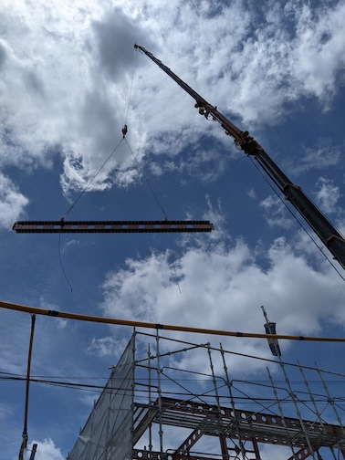
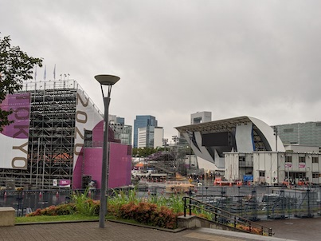

# これまで
* 2020/8 ~ 2021/4の出来事は[前回の記事](/441/)に書きました。

# 2021/5
* 地鎮祭をおこなった。地鎮祭自体はやってもやらなくてもよかったけど、どちらかと言うと、これを機に工事担当の方や近所へのあいさつをしておきたかった。
* 地鎮祭が済んだあと、工事がはじまった。以後、隔週で休日に現地まで行って進捗を確認していた。5月末くらいには基礎はほぼできており、思っていた以上のスピードで工事が進んでいた。
* 4月の契約後にハウスメーカー（以下、HM）の担当者と外構計画の打ち合わせがあると思って待っていたけど、おこなわれなかった。

# 2021/6
* 6月中には外側は完成した。内装工事の方が時間がかかるとのことだった。
* HM担当者をつついてみたところ、外構についての打ち合わせが6月下旬にようやくおこなわれ、HMとは別の業者に外構の設計を依頼するために必要な図面を手に入れた。
* セコムとの打ち合わせをおこなった。セキュリティ機器の工事が家の内装工事のタイミングにギリギリ間に合うことがここでわかったので、変更契約後、工事が始まるまでに本来ならセコムなどと話を済ませておいた方が本当はいいのかもしれない。
* 火災保険の担当者と打ち合わせをおこない、保障内容を決定した。うちの土地はハザードマップ上は安全なので、水害の保証は最小限に抑えた。
* 入居2ヶ月前のタイミングでNURO光の工事予約を引き渡しから数日後にとった。

# 2021/7
* 工事は内装工事がおこなわれていた。断熱材や柱がむきだしの状態の家におじゃまして柱に落書きした。
* この頃は家づくりに疲れ果てて仕事や開発に専念していたかもしれない。ほぼ進捗がない。
* あんまり関係ないけどコロナワクチンを摂取した。

# 2021/8
* HMとは別の外構業者に図面を渡して、おおまかな提案をしてもらった。HMからの提案よりも内容がよかった。ただ、業者も繁忙期らしく着手が11月になるとのことだった。もっと早く外構も進められたらよかった。
* ダイニングテーブルやベッド、冷蔵庫など必要な家具・家電を買いに行った。
* 月末に最終確認をおこない、家が引き渡された。引っ越しまで3週間ほど猶予がある。

# 2021/9
* 引っ越したあとに必要となる細々としたものを注文し、休日に新居で受け取っていた。
* カーテンを買いに行ったが、タイミングがおそすぎて受け取りが10月頭（これを書いている日の朝方）になってしまった。カーテンも採寸などちゃんとやろうとすると、そこそこ時間がかかるので早めに動いた方がよかった。
* 外構業者と具体的な打ち合わせを進めた。これからの季節は植物の選択肢がどんどん少なくなってくるため、植栽だけ春ごろに延期する可能性も出てきた。キャッシュフローを考えるとそのほうがありがたい気もする。
* 連休を使って引っ越しした。役所での手続きや前の家の退去手続を連休中に済ませた。
* 住宅ローンの契約をおこなった。具体的な毎月支払う金額が判明した。事前にFPとかなり相談して予算を決めていたものの、あらためて無理なく支払える範囲に収まってよかった。

# 今後
* 住宅ローンが振り込まれ、HMに工事代金を支払う。
* 生活を整えて家のポテンシャルを引き出していきたい。
* 家はできたものの外構がまだで庭が手つかずの状態になっているため、外構業者との打ち合わせを進める。
