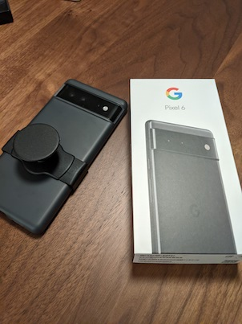

年末、Pixel 3がホームボタンを押していないのに押されたときのような動作を繰り返したり、再起動を繰り返すようになってしまった。修理店に持ち込んだところ、ゴーストタッチと呼ばれる現象とリンゴ（Google）ループと呼ばれる現象が同時に起きているとのことだった。修理には4万円程度かかるとのことだったので、Pixel 6を買うことにした。

覚えている限りだと、スマートフォン遍歴はこうなる。

1. iPhone 3GS
2. iPhone 5
3. iPhone 6
4. Pixel 3
5. Pixel 6

Pixel 3を買ったのが[当時の記事](./351/)によると3年前だったので値段の割には短命だった。

写真のとおり、Pixel 6の裏に[PopGrip Slide Stretch](https://amzn.to/33ai1WN)というスマートフォンホルダーを取り付けてみた。以前は貼り付けるタイプのホルダーを使っていたけど、粘着力が徐々に弱くなって剥がれてしまうのと、ケースに貼り付けるのに抵抗感があったため、取り付けるタイプにしてみた。

2, 3日操作してみた印象はこんな感じ。

* 縦が長くなったのでTwitterが見やすくなった
* 指紋認証が後ろから前になったので使いやすくなった
* PopGripのおかげで片手で操作できるようになったものの、かなり重く感じる
* 写真は正直あんまり違いがわからなかった
