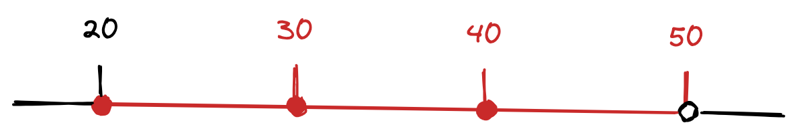

MySQLのネクストキーロックについて理解できていない気がしてきたので、あらためて手を動かしながら動作を理解する。前提として、分離レベルは`REPEATABLE-READ`で考える。

下のようなテーブルを例にとる。

```sql
CREATE TABLE users (
  id INT NOT NULL AUTO_INCREMENT,
  name VARCHAR(255) NOT NULL,
  age INT NOT NULL,
  PRIMARY KEY (id)
)
```

また、すでに下のようにデータが入っているとする。

```
+----+-------+-----+
| id | name  | age |
+----+-------+-----+
| 1  | alice | 20  |
| 2  | bob   | 30  |
| 3  | carol | 40  |
| 4  | dave  | 50  |
+----+-------+-----+
```

このとき、下のクエリがどのような範囲にロックを取得するか確認する。

```sql
SELECT * FROM users WHERE age BETWEEN 30 AND 40 FOR UPDATE;
```

# インデックスあり
まずは`age`カラムにインデックスがある場合のネクストキーロックの動作を確認する。

```sql
START TRANSACTION;
SELECT * FROM users WHERE age BETWEEN 30 AND 40 FOR UPDATE;
```

```
+----+-------+-----+
| id | name  | age |
+----+-------+-----+
| 2  | bob   | 30  |
| 3  | carol | 40  |
+----+-------+-----+
```

この状態で別セッションから`users`テーブルに操作を試みる。

```sql
INSERT INTO users (name, age) VALUES ('naoty', 19);
-- Query OK, 1 row affected
INSERT INTO users (name, age) VALUES ('naoty', 20);
-- Lock wait timeout exceeded; try restarting transaction
INSERT INTO users (name, age) VALUES ('naoty', 49);
-- Lock wait timeout exceeded; try restarting transaction
INSERT INTO users (name, age) VALUES ('naoty', 50);
-- Query OK, 1 row affected
```

```sql
UPDATE users SET age = 60 WHERE id = 1;
-- Query OK, 1 row affected
UPDATE users SET age = 60 WHERE id = 2;
-- Lock wait timeout exceeded; try restarting transaction
UPDATE users SET age = 60 WHERE id = 3;
-- Lock wait timeout exceeded; try restarting transaction
UPDATE users SET age = 60 WHERE id = 4;
-- Lock wait timeout exceeded; try restarting transaction
```

ネクストキーロックの範囲を整理するとこうなる。

* マッチした行とその前の行の間（末端含む）のギャップロック
* マッチした行のレコードロック
* マッチした行の次の行のレコードロック
* マッチした行とその次の行の間（末端含まない）のギャップロック

分かりづらいので図にしてみた（赤い部分がロック）。



# インデックスなし

```sql
START TRANSACTION;
SELECT * FROM users WHERE age BETWEEN 30 AND 40 FOR UPDATE;
```

```sql
INSERT INTO users (name, age) VALUES ('naoty', 19);
-- Lock wait timeout exceeded; try restarting transaction
INSERT INTO users (name, age) VALUES ('naoty', 20);
-- Lock wait timeout exceeded; try restarting transaction
INSERT INTO users (name, age) VALUES ('naoty', 49);
-- Lock wait timeout exceeded; try restarting transaction
INSERT INTO users (name, age) VALUES ('naoty', 50);
-- Lock wait timeout exceeded; try restarting transaction
```

```sql
UPDATE users SET age = 60 WHERE id = 1;
-- Lock wait timeout exceeded; try restarting transaction
UPDATE users SET age = 60 WHERE id = 2;
-- Lock wait timeout exceeded; try restarting transaction
UPDATE users SET age = 60 WHERE id = 3;
-- Lock wait timeout exceeded; try restarting transaction
UPDATE users SET age = 60 WHERE id = 4;
-- Lock wait timeout exceeded; try restarting transaction
```

スキャンされた行すべてに対してネクストキーロックを取得しているため、ことごとく操作が失敗している。
