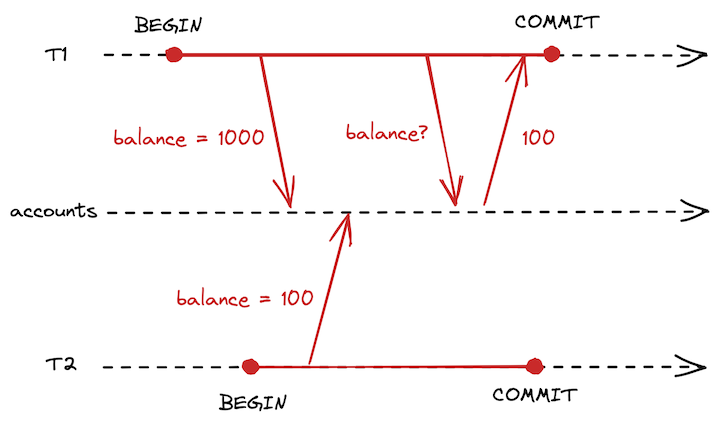
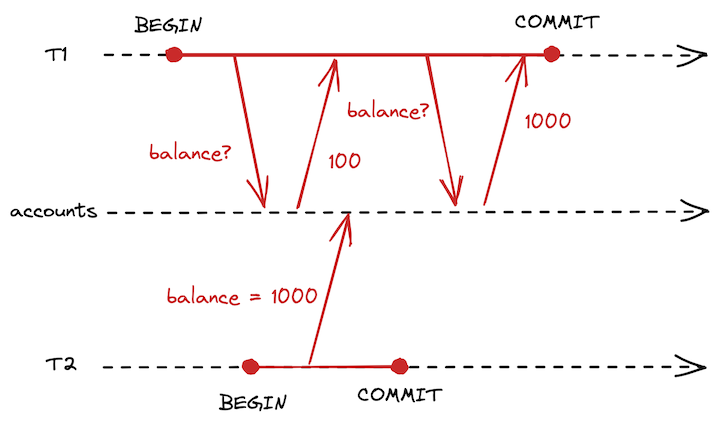
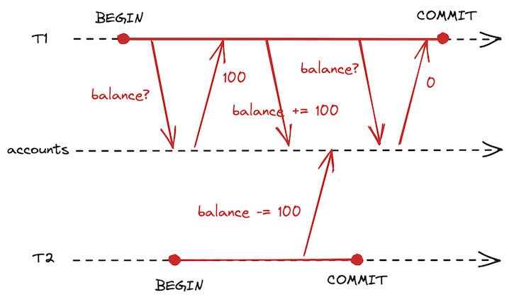
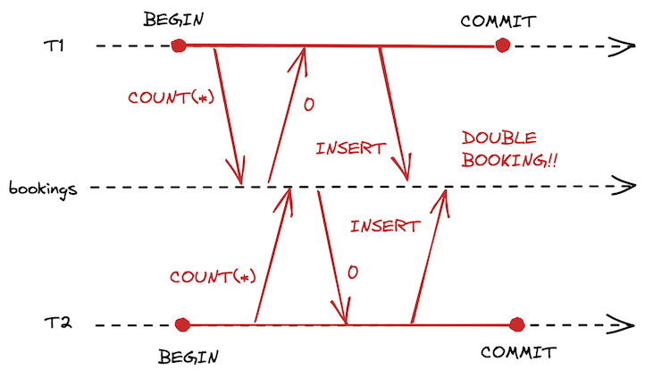

古くからある有名な問題なのだけど、文章で何回読んでも頭にすんなり入らないので、できるだけシンプルに理解するため図を書いて整理してみた。

# Dirty Reads

* コミットしていない変更が他のトランザクションから見える。

# Dirty Writes

* コミットしていない変更が他のトランザクションに上書きされる。

# Non-Repeatable Reads

* 同じトランザクションでも読み取るタイミングによって結果が変わり整合性がとれなくなる。
* Dirty Readsとの違いはコミットされた変更によっても影響を受ける点。
* バックアップや分析用途でのクエリで問題になりうる。

# Lost Updates

* 2つ目の変更が1つ目の変更を踏まえていないため、1つ目の変更が失われる。
* 前の値に基づいて変更する処理が並行する場合に発生する。
* 例: カウンターの更新、JSONの書き換え

# Phantom Reads

* 変更すべきか判断する条件が判断後に別のトランザクションによって影響を受ける。
* 「条件の確認」「変更すべきか判断」「変更」という3ステップの処理が並行する場合に発生する。
* 例: 会議室の予約（会議室が空いていれば予約）、商品の購入（在庫があれば購入）
