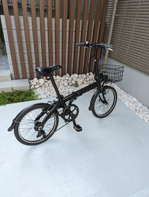

2ヶ月くらい前のことなんだけど、自転車を買った。

引っ越してきてもう半年以上経って、こちらの生活にはすっかり慣れてしまったけど、駅まで徒歩20分以上かかるのが少し億劫だった。一人で出かけるときは家から数分歩いたところにあるドラッグストアでレンタル自転車を借りていた。それも悪くはなかったけど、運が悪いとタイヤの空気がほぼ抜けている自転車を引いたりすることがあったので、自分の自転車を買うことにした。

隣町にミニベロ専門店がたまたまあったので、その中で予算におさまるいい感じのものにした。買い物にも使うだろうし、カゴもつけてもらった。いざ乗ってみると、思っていた以上にサドルが狭くて尻が痛い。2ヶ月経った今はだんだん慣れてきたけど、当初は30分も乗ってられなかった。

自転車のおかげで近所のスーパーに買い物に行ったり、駅前のゲーセン行ったり、市役所行ったりするのが本当に楽になった。うちの市は道路が整備されていて、自転車レーンも確保されている。そして、並木が必ず立っているので、走っていて気持ちがいい。東京オリンピックで自転車競技が行われたような場所だから、それはそうか。いい買い物をしたと思う。
