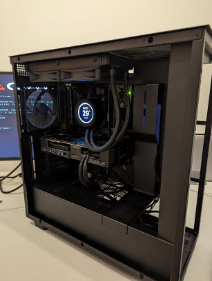
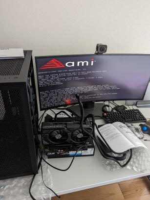

はじめてPCを自作した。いままで使っていたMacbook Proはたしか9年くらい前に買ったもので、ChromeとDockerとIDEを同時に起動するとカクカクに固まってしまうからPCを新調しようとしたんだけど、せっかくなら将棋の解析とか生成系のAIの実験なんかに使えそうな強いグラボを積んだPCを自作してみたくなって、トライしてみた。

# 情報収集
はじめての自作PCだったので、事前に入念に情報収集はした。基本的にはYouTubeにいろんな動画が上がっているのでそれを見つつ、不足する情報を検索し、Scrapboxに得た知識を整理して学んでいった。なんだかんだ情報収集しているときが一番楽しかった気がする。

# パーツ
パーツ類はこんな感じ。

- CPU: Intel Corei5 13400F
- マザーボード: ASUS TUF Gaming B760M-PLUS Wifi D4
- グラフィックボード: ASUS Dual GeForce RTX 4070 OC Edition
- CPUクーラー: NZXT Kraken Elite 240 Black
- ケース: NZXT H7 Flow Black
- ケースファン: NZXT F120Q 120mm
- 電源ユニット: NZXT C650
- メモリ: Crucial RAM 32GB Kit DDR4 3200MHz
- SSD: Crucial P5 SSD 1TB

予算はだいたいMacbook Proの新品と同じくらいになるように考えた。また、初の自作だったので、余計なトラブルを避けるためにメーカーをなるべく揃えるようにしたり、最新のチップセットを使うようにした。IntelかAMDかはあんまりこだわりがなかったのでCPUは無難にIntelにし、グラボは最新の4000番台でワットパフォーマンスがよさそうなRTX 4070にした。

当初は部屋のインテリアとの相性を考えて白系のPCを組みたいと考えていたのだけど、白系のパーツはあまり多くなかったり全体的に白くても付属のケーブルは黒だったり細部まで気にし始めるとかなり難易度が高いと思った。なので、振り切ってPCを黒に統一した。また、ゲーミング用途のPCにありがちなRGBでレインボーな装飾は趣味に合わないのでいっさい排した（あまりに味気がないのでKraken Eliteを丸形ディスプレイのためだけに導入した）。

# 初の自作
自作は昼から始めて夜にはなんとか終わった。苦戦したところはこんなところだった。

- マザーボードのどのピンにどのケーブルを差せばよいかわからなかった。また、マザーボードやラジエーターをケースに取り付けたあとでファンのケーブルを差し込むことになったけど、先にケーブルだけ差してからラジエーターを取り付けた方がよかった気がする。差し込む箇所が狭くて自分の指で隠れてかなり大変だった。
- 電源ユニットに付属していたケーブルが固すぎて、ケース内の穴から通してマザーボードに接続するのになかなか曲がらず苦労した。また、電源がつかないことがあったけど、24ピンをグリグリねじ込んだら電源がつくようになって、無理にケーブルを曲げてマザーボードに接続していたのがよくなかったのかも。もう少しやわらかいケーブルにするか、ヘッドをL字型にしてほしい。
- ケースファン用のマザーボード側のピンが1箇所にしかないと勘違いしていて、あやうくタコ足ケーブルを買いそうになったけど、よくマザーボードの説明書を見るといろんな場所にケースファン用のピンがあることが分かり無駄な買い物をするところだった。
- UEFIではキーボードを認識しているのに、なぜかWindowsセットアップ画面でキーボードが認識されず、なにもできなくなった。日をおいてもう一度リトライしたらなぜかうまくいった。こういう気まぐれな一面も自作PCの醍醐味なのだろう。

# 感想
自作PCと聞くとはじめは高いハードルを感じていたけど、いざやってみると組み立てそのものはプラモの組み立てみたいな感じで、動画を見ながらやればそんなに苦労しなかった。パーツ選びの方が「そもそもグラボとは?」みたいなところから理解する必要があって大変なのだけど、プログラミングの勉強の延長みたいなものなのでそういうのが楽しめる人には実益も兼ねていておすすめできると思う。

これでPCのスペックがボトルネックになっていてできなかったことができるようになり、モチベーションがわいてきた。直近はまず15年以上ぶりのWindowsに慣れるところから始めていきたい。
